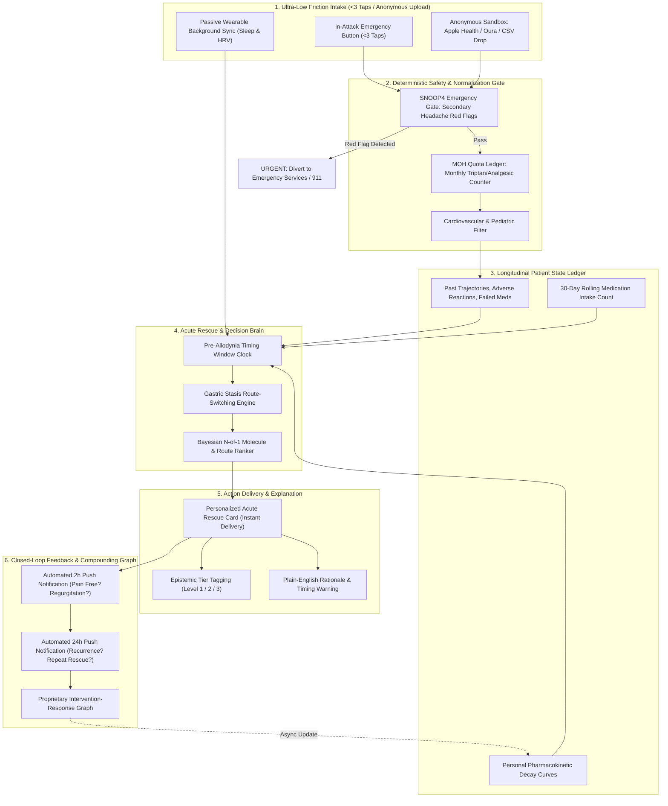

# Product Requirements Document (PRD)
## Project: MigraineRelief AI
> **Document Version:** 1.0.0  
> **Status:** Approved / Ready for Engineering  
> **Target Audience:** Product, Engineering, Design, Neurological Advisors, Regulatory Counsel  
> **Canonical Strategy Reference:** `migrainerelief_strategy.md` (Internal)  
> **Historical Inspiration:** `brainstorm.md`

---

## 1. Executive Summary & Product Vision

Migraine is the second leading cause of disability worldwide and the leading cause among young women, afflicting over 1.1 billion individuals. When acute attacks strike, patients face a severe double-bind: agonizing, paralyzing pain combined with acute cognitive dysfunction and nausea, forcing them to make high-stakes pharmacological decisions under extreme uncertainty.

Existing digital health tools fail sufferers at this critical moment:
* **Passive tracking diaries (e.g., Migraine Buddy)** demand exhausting 15-minute questionnaires while the patient is photosensitive, nauseated, and in 8/10 agony.
* **Open-domain AI chatbots (ChatGPT, Claude)** provide generic, post-hoc summaries with zero persistent memory of patient pharmacokinetics, formulation route mismatches, or medication overuse limits.
* **Diagnostic toys (e.g., 400-case Kaggle classifiers)** solve a problem already addressed by deterministic clinical criteria (ICHD-3).

### The Product Vision
**MigraineRelief** is an ultra-low friction, privacy-first precision clinical copilot engineered to solve the most painful, high-uncertainty decision in headache medicine: **the 60-minute acute rescue window**.

Rather than blaming arbitrary foods or making unvalidated 24-hour predictions, MigraineRelief matches patient phenotype, prodrome velocity, gastric motility state, and allodynia onset to the optimal abortive molecule, delivery route (oral vs. non-oral), and adjuvant antiemetic—while strictly enforcing Medication Overuse Headache (MOH) safety envelopes.

#### Foundational Definitions & Educational References
* **Prodrome Markers**: *Prodrome markers are early physical, behavioral, or biological signs that appear before a disease is fully diagnosed or reaches its severe phase.* In migraine, hypothalamic and brainstem activation produces subtle prodromal signals (neck stiffness, yawning, fluid retention, mood swings, photophobia) hours before headache pain strikes.
  * Educational Video: [(The role of prodromal symptoms in predicting headache onset)](https://www.youtube.com/watch?v=9MIx21I1FRY&t=223s)
* **Contemporary Acute Pharmacotherapies**: For a comprehensive clinical reference on acute migraine medications across age groups, formulation routes, and efficacy ladders:
  * Clinical Reference: [Acute Migraine Treatment & Medications Guide (CPS Position Statement)](https://cps.ca/en/documents/position/acute-migraine)

By instrumenting a closed loop between **Context → Intervention → Timing → Response → Outcome**, MigraineRelief builds the world's first proprietary **Intervention-Response Graph**, turning acute rescue failure into a predictable, compoundable science.

---

## 2. Problem Statement & Clinical Foundations

*(Derived from `brainstorm.md` Section 1.1, updated with First-Principles Neurology)*

### 2.1 The Clinical Reality of Migraine
Migraine is not "just a headache." It is an agonizing, complex neurovascular disorder characterized by:
1. **Cortical Spreading Depression (CSD)**: A self-propagating wave of neuronal and glial depolarization across the cerebral cortex, triggering visual and sensory auras.
2. **Trigeminovascular Activation**: Sensory afferents release vasoactive neuropeptides (Calcitonin Gene-Related Peptide [CGRP], Substance P, PACAP), causing neurogenic inflammation and severe throbbing unilateral or holocranial pain.
3. **Acute Autonomic Gastroparesis (Gastric Stasis)**: Within 30–60 minutes of attack onset, sympathetic outflow shuts down gastric emptying. Oral medications get trapped in the stomach, delayed from reaching the duodenum for absorption (Aurora et al., *Headache* 2022).
4. **The Race Against Central Sensitization (Cutaneous Allodynia)**: Within 60–120 minutes of headache onset, second-order neurons in the trigeminocervical complex and third-order neurons in the thalamus become sensitized. Once cutaneous allodynia locks in (scalp/skin sensitivity where light touch feels like burning embers), peripheral abortive medications (such as oral triptans) fail to abort pain (Burstein et al., *Ann Neurol* 2004).

### 2.2 Updated 2026 US Emergency Department (ED) Migraine Guidelines
*(American Headache Society Consensus led by Dr. Jennifer Robblee)*

In the updated clinical consensus for acute migraine in emergency and urgent care settings, the evidence base was formally restructured around non-opioid, mechanistically targeted parenterals. Dr. Jennifer Robblee and colleagues established two **Level A ("Must Offer")** recommendations:
1. **Intravenous (IV) Prochlorperazine (prochlorazine)**: Dopamine antagonist with potent antiemetic and central analgesic properties, clinically demonstrated to outperform hydromorphone without addiction liability ([PubMed: 11335783](https://pubmed.ncbi.nlm.nih.gov/11335783/)).
2. **Greater Occipital Nerve Blocks (GONB) for Migraine Patients Including Teens**: Target peripheral infiltration with local anesthetics (bupivacaine/lidocaine) that rapidly quiets afferent inputs to the trigeminocervical complex, providing effective relief even in pediatric and adolescent refractory migraine ([Nerve Blocks in Pediatric and Adolescent Headache Disorders, PubMed: 29124490](https://pubmed.ncbi.nlm.nih.gov/29124490/)).
3. **Opioid Restriction ("Must NOT Offer")**: Level A recommendation explicitly against IV hydromorphone and IV opioids due to proven lack of efficacy and high risk of perpetuating chronic transformation and rebound headache.
* Guideline Discussion & Overview: [Dr. Jennifer Robblee SGEM Presentation](https://thesgem.com/2026/01/sgem-xtra-hit-me-with-your-best-block-2025-ahs-ed-migraine-guidelines/) | [YouTube Video Overview](https://www.youtube.com/watch?v=JmYj-90V63w)

### 2.3 The Three Clinical Tragedies
* **The Acute Rescue Failure Roulette**: 30% to 50% of acute migraine rescue attempts fail because medications are taken too late or administered orally during gastric stasis, leading to violent vomiting fits, prolonged disability, and emergency department visits.
* **The Medication Overuse Headache (MOH) Trap**: Sufferers taking triptans/ergots/opioids on $\ge 10$ days/month or NSAIDs on $\ge 15$ days/month transform episodic migraine into daily chronic refractory agony, unaware that their rescue medication is perpetuating the cycle.
* **The Privacy & Surveillance Barrier**: Traditional digital health tools collect invasive Protected Health Information (PHI), selling aggregate data to advertisers and insurers, creating severe adoption resistance among privacy-sensitive users.


---

## 3. Target User Personas & Clinical Scenarios

*(Derived from `brainstorm.md` Section 3, mapped to the Acute Rescue Architecture)*

```
+----------------------------------------------------------------------------------------------------+
|                                    TARGET CLINICAL PERSONA MATRIX                                  |
+------------------------------------+---------------------------------------------------------------+
| Dimension                          | Persona 1: Alexa Rivera                                       | Persona 2: Claire Sterling                    |
+------------------------------------+---------------------------------------------------------------+
| Gender / Age / Role                | Female, 15 / High School Sophomore                            | Female, 45 / Professional & Mother            |
| Clinical Classification            | Episodic Probable Migraine without Aura                       | Chronic Refractory Migraine with Gastroparesis|
| Attack Frequency / Duration        | 2–4 attacks/month; 6 to 18 hours per attack                   | 18–22 days/month; 24 to 72 hours per attack   |
| Primary Acute Barrier              | Unpredictable school onset; sedative medication limits        | Severe nausea & vomiting fits; oral malabsorption|
| Past Treatment History             | OTC NSAIDs (ibuprofen, naproxen), acetaminophen (MOH risk)    | 20+ years; failed triptans, TCAs, Botox, AEDs |
| Key Psychological Need             | Academic preservation; privacy; stigma reduction              | Emergency crisis rescue; dignity; non-oral relief|
+------------------------------------+---------------------------------------------------------------+
```

### 3.1 Persona 1: Alexa Rivera — The High School Sophomore (Adolescent Episodic Migraine)
* **Demographics**: 15-year-old female, high school sophomore.
* **The Living Reality**: Attacks strike unpredictably during high-stress exam weeks, in fluorescent-lit classrooms, after skipped cafeteria meals, or following pubertal hormonal shifts (luteal-phase estrogen drop). When an attack hits at school, Alexa experiences blinding photophobia, throbbing unilateral pain, and cognitive clouding ("brain fog"). School nurses frequently dismiss her pain as adolescent anxiety, stress headache or academic avoidance.
* **Pharmacological & Regulatory Constraints**:
  - **Pediatric Labeling Constraints**: Most adult migraine drugs lack FDA clearance under 18. Only a small subset (e.g., oral rizatriptan for ages 6+, zolmitriptan/almotriptan nasal sprays for ages 12+) carry pediatric indications.
  - **MOH Rebound Risk**: Frequent reliance on over-the-counter analgesics (Excedrin, ibuprofen) puts Alexa at catastrophic risk of chronic transformation.
  - **Sedation Restrictions**: Alexa cannot take sedating rescue medications (e.g., promethazine, diphenhydramine) during the school day.
* **How MigraineRelief Solves Alexa's Problem**:
  - **Zero-PII Anonymous Access**: Alexa can use the platform without school or parental surveillance fears (`anonymousPatient_0`).
  - **Pediatric Safety Filtering**: Ensures recommended acute protocols comply strictly with FDA pediatric indications and non-sedating criteria.
  - **MOH Monthly Quota Meter**: Visually guards Alexa against taking OTC combination analgesics on more than 9 days per month.
  - **Prodrome Window Alert**: Teaches Alexa to spot subtle prodromes (neck stiffness, yawning) and execute non-sedating rescue within the 30-minute pre-allodynic window.

### 3.2 Persona 2: Claire Sterling — The 20-Year Chronic Refractory Sufferer
* **Demographics**: 45-year-old female, senior corporate manager and mother (perimenopausal migraine exacerbation).
* **The Living Reality ("The Bathroom Floor Agony")**:
  - Two decades of chronic refractory migraine (>18 headache days/month). Has systematically cycled through and failed beta-blockers, topiramate, amitriptyline, valproate, Botox, and multiple triptans.
  - When severe attacks peak, severe autonomic activation triggers **acute migraine-induced gastric stasis (gastroparesis)** and violent vomiting fits.
  - Oral tablets, liquids, and antiemetics are immediately vomited or stalled in the stomach. Scalp allodynia makes hair resting on her head feel like burning embers.
  - She spends 8 to 14 hours curled on cold bathroom tile in total darkness, incapacitated.
* **Pharmacological & Regulatory Constraints**:
  - **Zero Oral Bioavailability**: Any oral abortive (tablets, capsules) is useless during gastric stasis.
  - **Cardiovascular & Triptan Non-Response**: Developed chest tightness from sumatriptan; requires non-vasoconstrictive alternatives (gepants, ditans) or upper nasal space DHE.
* **How MigraineRelief Solves Claire's Problem**:
  - **Real-Time Gastric Stasis Route Switcher**: When Claire reports nausea, the system immediately suppresses oral tablets and activates her prescribed Tier-2 Non-Oral Rescue Protocol (Intranasal POD DHE, SC Sumatriptan auto-injector, or Nasal Zavegepant + Rectal/SC antiemetic).
  - **Pre-Allodynia Urgency Timer**: Notifies Claire the instant aura begins to inject before cutaneous allodynia locks in central pain pathways.
  - **Physician Refractory Dossier**: Generates a clean, exportable clinical summary documenting her step-therapy failures and route requirements for specialist visits and insurance prior-authorizations.

---

## 4. Product Strategy & Core Wedge

### 4.1 Product Positioning Formula
> **For** individuals with episodic or chronic migraine experiencing frequent rescue failures and unpredictable attacks,  
> **MigraineRelief** helps them **abort acute attacks within 2 hours and eliminate medication overuse rebound**  
> **by** intelligently optimizing medication timing, formulation route (oral vs. non-oral), and adjuvant therapies during the critical pre-allodynic window,  
> **unlike** passive symptom diaries (Migraine Buddy) that demand tedious logging during pain, or generic chatbots that offer ungrounded post-hoc advice.

### 4.2 The Decision-Value Chain
```
USER PROBLEM      → Throbbing pain, vomiting, cognitive paralysis, fear of 72h disability
UNCERTAINTY       → "Is this escalating? Should I take an acute pill now? Will oral pills work with nausea?"
REQUIRED INFO     → Attack velocity, prodromal state, gastric motility, 30-day analgesic balance
DATA              → Time-stamped prodrome check, wearable sleep/HRV deviance, minutes elapsed since onset
SIGNAL            → Autonomic shift + neck stiffness; 35 min elapsed; acute nausea reported; 8/10 MOH days used
INFERENCE         → High escalation probability; oral route 70% failure risk; high MOH rebound risk
DECISION          → Bypass oral route; avoid triptan class; select non-oral CGRP gepant or SC sumatriptan
ACTION            → Patient administers non-oral rescue within the 30-minute pre-allodynia window
OUTCOME           → 2-hour pain freedom achieved; gastric vomiting avoided; MOH safety limit preserved
FEEDBACK          → 2h and 24h automated check-ins update N-of-1 PK model and cohort prior distributions
```

### 4.3 Epistemic Certainty Tiers
Every insight, alert, and recommendation rendered in MigraineRelief is tagged with an explicit epistemic certainty tier to prevent clinical overreach:
* **Level 1: Confirmed Clinical Protocol** (Deterministic medical ground truth: ICHD-3 criteria, SNOOP4 emergency red flags, FDA drug interactions, contraindications, MOH monthly quotas).
* **Level 2: Probabilistic Clinical Trial Prior** (Established Bayesian priors derived from published Phase III clinical trials: $T_{\max}$ absorption curves, route efficacy under gastric stasis, Burstein allodynia timing decay).
* **Level 3: Exploratory Population Prior — Observational Public Baselines** (Correlational priors extracted from public datasets: 400-case Kaggle Ranzeet013 diagnostic classifier, 11,879 patient-day wearable lifestyle cohort, UK Biobank Field 20002 non-cancer illness survey). These provide non-causal hypothesis generation and initial Bayesian anchors, never concatenated into a single synthetic matrix.
* **Level 4: Patient-Specific Posterior — N-of-1 Personalization** (Individualized Bayesian posterior distribution: $P(\text{2h pain freedom} \mid \text{Intervention}, \text{Timing}, \text{Baseline Severity}, \text{Context})$. Conjugate Beta-Binomial updating where trial likelihood smoothly supersedes the population anchor prior as personal longitudinal episodes accumulate).

### 4.4 Fair Test & External Validation Architectural Mandate
To ensure clinical rigor and scientific reproducibility, all machine learning evaluation adheres to:
1. **Strict Holdout Lock**: Development, feature engineering, and hyperparameter tuning occur exclusively within development cross-validation. The final holdout set is evaluated **exactly once** after model selection is frozen.
2. **Anti-Leakage Patient Splitting**: Any dataset with repeated patient measures (such as the 11,879 patient-day wearable cohort) strictly mandates patient-level grouping (`SplitStrategy.PATIENT_GROUPED`). Row-level random splitting raises a fatal `PatientLeakageError`.
3. **Six-Model Tournament**: Benchmarks Logistic Regression, Decision Tree, Random Forest, XGBoost, LightGBM, and CatBoost under identical CV splits with multi-attribute selection (Macro F1, calibration ECE, Brier score).
4. **Three-Tier Explainability**: Tier A (explicitly non-causal global SHAP hypotheses), Tier B (patient-level waterfall separating fixed clinical from modifiable lifestyle factors), and Tier C (cross-fold feature attribution stability scoring).
5. **Cross-Dataset Replication Engine**: Tracks whether findings replicate across independent cohorts without pooling heterogeneous rows.


---

## 5. System Architecture & Decoupled Engines



### 5.1 Identity & Account Persistence Layer (`SRP-alohamora/supabase-opensrc-auth`)
* **Open-Source Auth & RBAC**: Integrated via [`SRP-alohamora/supabase-opensrc-auth`](https://github.com/SRP-alohamora/supabase-opensrc-auth). Provides secure user registration, email/magic-link login, cryptographic session JWTs, and administrative role enforcement.
* **Persistent Clinical State**: Authenticated users have customized intake forms, aura configurations, and personalized rescue protocol preferences persisted directly into PostgreSQL via Row-Level Security (RLS).
* **Administrative Governance**: An Admin console enables system administrators to reset passwords, view all accounts, and archive or permanently purge accounts (GDPR right-to-be-forgotten).
* **Near-$0 COGS Guarantee**: Deployed via free managed cloud tiers (up to 50k MAU) or self-hosted sovereign Docker containers alongside FastAPI, ensuring zero marginal cost per user.

---

## 6. Detailed Feature Specifications

### Feature 1: The Anonymous Self-Service Diagnostic Sandbox (Day-0 Intake)
* **Goal**: Provide instant, zero-barrier diagnostic value on Day 1 using historical user data, solving the cold-start problem without requiring accounts or PHI.
* **User Flow**:
  1. User accesses web app (zero login, zero cookies, zero email).
  2. Drag-and-drops an Apple Health `export.xml`, Oura `export.json`, or spreadsheet diary (or completes an optional 2-minute retrospective survey).
  3. Client-side WebAssembly parser processes data entirely within browser memory (`anonymousPatient_0`).
  4. Immediate personal diagnostic report rendered:
     - **Historical Rescue Failure Post-Mortem**: Identifies past attacks where oral triptans were taken >90 min post-onset with nausea, estimating absorption failure rate.
     - **Cumulative Stressor Threshold Audit**: Evaluates past attacks against sleep debt (<5.5h) and stress deltas using Kaggle/literature priors.
     - **MOH Rebound Risk Scan**: Audits 30-day rolling periods against ICHD-3 $\ge 10$ day criteria.
  5. User saves local encrypted key (`AES-GCM-256`) and pins the `<3-Tap Emergency Attack Button` to their mobile home screen.

### Feature 2: In-Attack Real-Time Rescue Copilot (<3-Tap Emergency Flow)
* **Goal**: Minimize cognitive load during photophobia and severe pain, delivering optimal guidance in $<15$ seconds.
* **User Flow**:
  1. **Tap 1**: User taps glowing red button: `[Attack Starting / Migraine Alert]`.
  2. **Tap 2**: User answers single binary question: `[Nausea Present? YES / NO]`.
  3. **Tap 3 (Optional)**: Aura present (`YES / NO`).
  4. **Output**: System immediately generates the **Personalized Acute Rescue Card**:
     - Specific molecule, dose, and route from the patient's approved profile.
     - Exact timing urgency: *"Administer within the next 25 minutes before central sensitization locks in."*
     - Clear epistemic tier badge.

### Feature 3: Gastric Stasis & Formulation Route Switcher
* **Goal**: Prevent acute rescue failure caused by gastroparesis and oral malabsorption.
* **Logic**:
  - `IF Nausea == True OR Vomiting == True OR Minutes_Elapsed > 90`:
    - Suppress oral tablet recommendations.
    - Elevate prescribed non-oral routes:
      - *Option A*: Intranasal spray (e.g., Zavegepant, Zolmitriptan, POD DHE).
      - *Option B*: Subcutaneous auto-injector (e.g., Sumatriptan 4mg/6mg SC).
      - *Option C*: Prescribed prokinetic/antiemetic adjuvant (e.g., Metoclopramide 10mg / Ondansetron ODT) 15 minutes prior to oral rescue.
  - Display clinical rationale: `[Level 1: Confirmed Clinical Protocol]` *"Migraine-induced gastric stasis arrests stomach absorption. Oral tablets have a 70% failure rate when taken during nausea."*

### Feature 4: Medication Overuse Headache (MOH) Quota Ledger
* **Goal**: Halt the transformation from episodic to chronic migraine caused by analgesic rebound.
* **Logic**:
  - Implements rolling 30-day intake ledger for each medication class based on ICHD-3 Section 8.2:
    - Triptans, Ergots, Opioids, Combinations: Max **9 days per rolling 30 days** (Limit: 10).
    - Simple Analgesics (NSAIDs, Acetaminophen): Max **14 days per rolling 30 days** (Limit: 15).
  - When user reaches limit (e.g., 9/10 triptan days):
    - System issues **Hard Warning**: *"MOH Threshold Imminent. Taking a triptan today risks rebound chronic migraine."*
    - Automatically diverts patient to non-pharmacological or non-MOH rescue options: neuromodulation devices (Nerivio, Cefaly), peripheral nerve blocks, or urgent physician triage.

### Feature 5: Closed-Loop High-Fidelity Outcome Capture (2h & 24h)
* **Goal**: Instrument the gold-standard FDA/ICHD-3 clinical trial endpoints with zero survey friction.
* **Logic**:
  - **At $t = 2.0$ Hours Post-Rescue**: System sends automated mobile push notification:
    - Prompt: *"How is your head right now?"*
    - Single-tap responses: `[Pain-Free 🟢]`, `[Mild / Manageable 🟡]`, `[Severe / Unchanged 🔴]`, `[Regurgitated / Vomited 🤮]`.
  - **At $t = 24.0$ Hours Post-Rescue**: System sends secondary push notification:
    - Prompt: *"Did the headache return today?"*
    - Single-tap responses: `[No Recurrence 🟢]`, `[Recurrence (Took 2nd Dose) 🟡]`, `[Continuous Agony 🔴]`.
  - **Graph Storage**: The resulting tuple `(Phenotype, Timing_Δt, Route, Nausea_Present, Outcome_2h, Outcome_24h)` is appended to the patient's local encrypted ledger and (with consent) the de-identified global Intervention-Response Graph.

### Feature 6: Cumulative Stressor Threshold Meter (Reframing Triggers)
* **Goal**: Eliminate trigger orthorexia and food anxiety by modeling migraine as a multi-factorial allostatic threshold disorder.
* **Logic**:
  - Calculates daily brain sensitivity:
    $$\text{Threshold Resistance} = 1.0 - \Big(w_{\text{sleep}} \Delta\text{SleepDebt} + w_{\text{stress}} \Delta\text{StressDrop} + w_{\text{hormone}} \text{LutealDrop}\Big)$$
  - Initialized with **Kaggle wearable baseline prior weights** ($w_{\text{sleep}} = 0.45, w_{\text{stress}} = 0.35$).
  - UI displays a simple "Brain Resistance Meter" (High / Moderate / Sensitive).
  - Messaging: *"Your threshold is lower today due to 4.5 hours of sleep. You don't need to fear triggers—just keep your acute rescue kit nearby."*

### Feature 7: Clinical Safety Gates & SNOOP4 Emergency Triage
* **Goal**: Protect patient safety and eliminate legal liability by identifying life-threatening secondary headaches.
* **Logic**:
  - Continuous deterministic filter across all intakes. Checks for:
    - **S**ystemic symptoms (fever, unexplained weight loss).
    - **N**eurological deficits (unilateral motor paralysis, sudden speech loss, confusion).
    - **O**nset sudden (thunderclap headache reaching 10/10 intensity in $<1$ minute — rule out subarachnoid hemorrhage).
    - **O**lder onset (new headache type after age 50).
    - **P**ostural aggravation or papilledema.
  - **Action**: If any SNOOP4 flag triggers, the app locks acute guidance, displays an unclosable red alert banner, and instructs immediate 911 / emergency department consultation.

### Feature 8: Open-Source Account Authentication & Clinical State Persistence (`SRP-alohamora/supabase-opensrc-auth`)
* **Goal**: Provide enterprise-grade, privacy-preserving account creation, secure login, and cross-device synchronization of patient clinical profiles and customized rescue protocols with near-zero infrastructure cost.
* **Authentication Engine**:
  - Implements the open-source Supabase GoTrue authentication engine ([`SRP-alohamora/supabase-opensrc-auth`](https://github.com/SRP-alohamora/supabase-opensrc-auth)).
  - Supported authentication modes:
    - **Email & Password Authentication**: Argon2id / bcrypt password hashing with rate-limited brute-force protection.
    - **Magic Link / Passwordless Authentication**: One-time cryptographic email tokens for low-friction, password-free login.
    - **Role-Based Token Claims**: Issues cryptographically signed JSON Web Tokens (JWT) containing `user_id`, `email`, and role claims (`authenticated`, `admin`).
  - Strict anonymous-to-authenticated upgrade path: Users can begin as `anonymousPatient_0` and later bind their local encrypted history to an authenticated account with one click.
* **User Customization & Form Submission Persistence**:
  - **Clinical Intake Synchronization**: When an authenticated user completes or customizes the diagnostic questionnaire (baseline migraine features, aura patterns, nausea susceptibility, allodynia velocity, past triptan adverse events, pediatric indicators):
    - Submitting the form immediately persists the clinical state vector to the `patient_custom_intakes` table in PostgreSQL, keyed to `auth.uid()`.
    - **Row-Level Security (RLS)**: Enforces strict tenant isolation (`auth.uid() = user_id`). Users can only read, write, or update their own personal clinical record.
    - **Rescue Protocol Customization**: Patients and their physicians can adjust their rescue kit (e.g., customizing default Tier-1 oral vs. Tier-2 non-oral formulations, antiemetic adjuvants, and dosage limits). This is stored in `patient_custom_intakes.customized_protocol`.
    - **Cross-Device State Rehydration**: Logging in on any secondary device, smartphone, or browser instantly rehydrates the saved questionnaire choices, customized rescue parameters, and rolling MOH counters, replacing ephemeral `localStorage` while retaining offline-first IndexedDB caching.

### Feature 9: Role-Based Admin Management & User Administration
* **Goal**: Empower clinical operations, system administrators, and principal investigators to administer user accounts, resolve login lockouts via password resets, manage account lifecycles, and enforce data governance without engineering intervention.
* **Admin Role & Access Gate**:
  - System provisions an initial pre-seeded `admin` account with elevated claims (`app_metadata: { role: 'admin' }`).
  - All administrative API endpoints (`/admin/*`) and UI views (`/admin`) enforce dual-layer cryptographic verification:
    1. Client-side route guard: Checks JWT role claim before rendering admin navigation or pages.
    2. Backend FastAPI / PostgREST safety gate: Deterministically verifies RS256/HS256 signature and asserts `claims['role'] == 'admin'`, returning `403 Forbidden` for unauthorized actors.
* **Administrative Capabilities**:
  1. **Account Directory Dashboard (`/admin`)**:
     - Interactive, paginated, searchable, and filterable table displaying all registered platform accounts.
     - Metadata columns: User ID (UUID), Email / Account Identifier, Registration Date (UTC), Last Active Timestamp, Account Status (`Active`, `Suspended`, `Archived`), Custom Clinical Profile Status (`Configured [View]` vs `Pending`), Rolling MOH Days.
     - Search & filtering: Fast lookup by email, status, registration date range, or clinical profile completeness.
  2. **Admin Password Reset**:
     - Admin can trigger an automated password recovery email dispatch or generate a secure, temporary, single-use password recovery link for any user experiencing authentication lockout.
     - Admin can directly set a provisional password requiring forced reset upon next login for assisted clinical onboarding.
  3. **Account Deletion & Archival Governance**:
     - **Soft Archival (`ARCHIVED`)**: Admin can mark an account as archived. Instantly revokes active JWT sessions and refresh tokens, preventing future logins while preserving anonymized clinical outcome vectors for longitudinal research models (if patient consented).
     - **Hard Purge (GDPR / HIPAA Right-to-be-Forgotten)**: Admin can execute a permanent delete operation, cascading deletion across `auth.users`, `user_profiles`, and `patient_custom_intakes`, completely obliterating any trace of the user's data from the active database.
     - **Audit Logging**: Every administrative action (password reset, status change, archival, deletion) is permanently appended to `admin_audit_logs` with admin UUID, target user UUID, timestamp, action type, and IP/user-agent metadata.

---

## 7. Data Strategy & Privacy Architecture

### 7.1 Zero-Knowledge Patient Schema (`anonymousPatient_0`)
To eliminate HIPAA vulnerabilities and protect vulnerable users (such as adolescents):
* No real names, email addresses, phone numbers, or IP addresses are stored.
* Patient profiles exist locally in browser storage, encrypted using **Web Crypto `AES-GCM-256`**.
* The public/cloud sync layer only receives fully anonymized, high-entropy cryptographic hashes:
```json
{
  "client_id": "anon_8f3d19a2e4c",
  "attack_event": {
    "timestamp_utc": "2026-09-07T03:15:00Z",
    "minutes_from_onset": 35,
    "gastric_stasis_flag": true,
    "allodynia_present": false,
    "selected_molecule": "Sumatriptan",
    "selected_route": "Subcutaneous",
    "dose_mg": 6,
    "adjuvant_antiemetic": "Metoclopramide",
    "outcome_2h_pain_free": true,
    "outcome_regurgitated": false,
    "outcome_24h_recurrence": false,
    "rolling_30d_moh_count": 6
  }
}
```

### 7.2 The Intervention-Response Graph Schema
Every closed-loop rescue event contributes to a multi-dimensional comparative effectiveness graph:
* **Node (Context)**: `[Phenotype, Age_Tier, Nausea_Status, Aura_Status, Baseline_HRV_Deviance]`
* **Edge (Intervention & Timing)**: `[Drug_Class, Molecule, Route, Timing_Δt, Adjuvant]`
* **Node (Outcome)**: `[2h_Pain_Freedom, Regurgitation_Rate, 24h_Recurrence, Functional_Restoration]`

### 7.3 Account Authentication, Relational Schema & Near-$0 COGS Mandate
To maintain uncompromising commercial viability, enterprise scalability, and patient privacy, MigraineRelief integrates the open-source Supabase stack ([`SRP-alohamora/supabase-opensrc-auth`](https://github.com/SRP-alohamora/supabase-opensrc-auth)) with an explicit Near-$0 Cost of Goods Sold (COGS) architecture.

#### 7.3.1 Near-$0 COGS Architectural Strategy
```
+------------------------------------------------------------------------------------------------------+
|                                    NEAR-$0 COGS INFRASTRUCTURE MODEL                                 |
+----------------------+-----------------------------------------------+-------------------------------+
| Layer                | Technology & Provider                         | Cost Structure                |
+----------------------+-----------------------------------------------+-------------------------------+
| Frontend Hosting     | Netlify Free Tier (Static React/Vite SPA)     | $0.00 / month (100GB egress)  |
| Identity & Auth      | Supabase Auth (GoTrue Open Source Engine)     | $0.00 / month (Up to 50k MAU) |
| Relational Database  | Supabase Managed PostgreSQL or Self-Hosted    | $0.00 / month (500MB DB free) |
| API & Rescue Compute | FastAPI Monolith (Free-tier Edge / Micro VM)  | $0.00 / month ($0–$5 max)     |
| Real-Time Triage     | Client-Side WebAssembly & Local IndexedDB     | $0.00 (Zero server compute)   |
+----------------------+-----------------------------------------------+-------------------------------+
| TOTAL COGS PER USER  | Up to 50,000 Active Monthly Users             | $0.000 / active user / month  |
+----------------------+-----------------------------------------------+-------------------------------+
```

* **Zero-Cost Deployment Options**:
  - **Tier 1 (Default Managed Cloud)**: Utilizes the official Supabase Free Tier powered by the open-source engine: provides up to 50,000 Monthly Active Users (MAUs), 500MB PostgreSQL storage, 1GB file storage, and unlimited API requests at **$0/month**. Combined with Netlify's 100GB free bandwidth, initial operating COGS is strictly **$0.00**.
  - **Tier 2 (Self-Hosted Sovereign Container)**: When scaling beyond 50,000 users or under strict institutional data sovereignty, the entire [`SRP-alohamora/supabase-opensrc-auth`](https://github.com/SRP-alohamora/supabase-opensrc-auth) container stack (GoTrue, PostgREST, PostgreSQL) runs directly via Docker Compose alongside FastAPI on existing sovereign compute, eliminating all per-seat and per-MAU vendor licensing fees.

#### 7.3.2 Relational Database & Security Schema

```sql
-- 1. Profiles Table (Linked to open-source auth.users)
CREATE TABLE public.user_profiles (
    id UUID PRIMARY KEY REFERENCES auth.users(id) ON DELETE CASCADE,
    email TEXT NOT NULL,
    role TEXT NOT NULL DEFAULT 'user' CHECK (role IN ('user', 'admin')),
    status TEXT NOT NULL DEFAULT 'active' CHECK (status IN ('active', 'suspended', 'archived')),
    created_at TIMESTAMPTZ NOT NULL DEFAULT NOW(),
    updated_at TIMESTAMPTZ NOT NULL DEFAULT NOW()
);

-- 2. Patient Customized Intake & Clinical Profile Table
CREATE TABLE public.patient_custom_intakes (
    id UUID PRIMARY KEY DEFAULT gen_random_uuid(),
    user_id UUID NOT NULL REFERENCES auth.users(id) ON DELETE CASCADE,
    form_values JSONB NOT NULL DEFAULT '{}'::jsonb,
    aura_patterns TEXT[] NOT NULL DEFAULT '{}',
    customized_protocol JSONB NOT NULL DEFAULT '{}'::jsonb,
    aura_progression_notes TEXT,
    gst_timestamp TEXT,
    created_at TIMESTAMPTZ NOT NULL DEFAULT NOW(),
    updated_at TIMESTAMPTZ NOT NULL DEFAULT NOW(),
    CONSTRAINT uq_patient_user UNIQUE (user_id)
);

-- 3. Administrative Audit Log Table
CREATE TABLE public.admin_audit_logs (
    id UUID PRIMARY KEY DEFAULT gen_random_uuid(),
    admin_id UUID NOT NULL REFERENCES auth.users(id),
    target_user_id UUID REFERENCES auth.users(id) ON DELETE SET NULL,
    action TEXT NOT NULL CHECK (action IN ('RESET_PASSWORD', 'CHANGE_STATUS', 'ARCHIVE_USER', 'DELETE_USER')),
    details JSONB DEFAULT '{}'::jsonb,
    timestamp_utc TIMESTAMPTZ NOT NULL DEFAULT NOW()
);

-- 4. Row-Level Security (RLS) Policies
ALTER TABLE public.user_profiles ENABLE ROW LEVEL SECURITY;
ALTER TABLE public.patient_custom_intakes ENABLE ROW LEVEL SECURITY;
ALTER TABLE public.admin_audit_logs ENABLE ROW LEVEL SECURITY;

-- Patients can view and update only their own profile
CREATE POLICY "Users can read own profile" ON public.user_profiles
    FOR SELECT USING (auth.uid() = id);

-- Patients can view and update only their own custom intake data
CREATE POLICY "Users can read own intake" ON public.patient_custom_intakes
    FOR SELECT USING (auth.uid() = user_id);

CREATE POLICY "Users can upsert own intake" ON public.patient_custom_intakes
    FOR ALL USING (auth.uid() = user_id)
    WITH CHECK (auth.uid() = user_id);

-- Admins have full read/write visibility across profiles and intakes
CREATE POLICY "Admins full access profiles" ON public.user_profiles
    FOR ALL USING (
        EXISTS (SELECT 1 FROM public.user_profiles WHERE id = auth.uid() AND role = 'admin')
    );

CREATE POLICY "Admins read intakes" ON public.patient_custom_intakes
    FOR SELECT USING (
        EXISTS (SELECT 1 FROM public.user_profiles WHERE id = auth.uid() AND role = 'admin')
    );

CREATE POLICY "Admins full access audit logs" ON public.admin_audit_logs
    FOR ALL USING (
        EXISTS (SELECT 1 FROM public.user_profiles WHERE id = auth.uid() AND role = 'admin')
    );
```

---

## 8. User Experience (UX) & Design Specifications

1. **Dark Mode / Photophobia-Optimized UI**:
   - The entire app defaults to an ultra-low luminance, pure dark palette (`#0B0D12` background, deep slate `#1E222D` cards, soft amber/cyan indicators).
   - Zero high-frequency animations or blinding white flashes.
2. **The <3-Tap In-Attack Experience**:
   - Giant, high-contrast touch targets ($\ge 64\text{px}$) designed for trembling hands, visual aura scotomas, and photophobic distress.
   - Text rendered at $\ge 18\text{pt}$ with high legibility (Inter/SF Pro Display).
3. **The Instant Action Card Layout**:
   ```
   +-------------------------------------------------------------+
   |  ⚡ ACUTE RESCUE ACTION CARD             [Level 1: Protocol]|
   +-------------------------------------------------------------+
   |  TAKE NOW (Elapsed: 28 min | Pre-Allodynia Window Active):  |
   |                                                             |
   |  👉 Sumatriptan 6mg Subcutaneous Auto-Injector             |
   |     + 10mg Metoclopramide Oral Tablet                       |
   |                                                             |
   |  ⚠️ ROUTE SWITCH APPLIED:                                   |
   |  Oral triptan bypassed due to reported nausea (gastroparesis|
   |  risk). SC injection bypasses stomach for 12-minute relief. |
   |                                                             |
   |  [ ✅ CONFIRM DOSE TAKEN ]        [ ⏳ DELAY (5 MIN) ]      |
   +-------------------------------------------------------------+
   |  MOH Ledger: 4/10 Triptan days used this month (Safe Zone)  |
   +-------------------------------------------------------------+
   ```
4. **User Authentication & Clinical Profile Synchronization UX**:
   ```
   +-------------------------------------------------------------+
   |  🔑 MIGRAINERELIEF SECURE ACCESS                 [✕ CLOSE]  |
   +-------------------------------------------------------------+
   |  [ Log In ]                        [ Create New Account ]   |
   |                                                             |
   |  Email Address:                                             |
   |  [ patient@example.com                                    ] |
   |                                                             |
   |  Password:                                                  |
   |  [ •••••••••••••••••                                      ] |
   |                                                             |
   |  [ Forgot password? ]                                       |
   |                                                             |
   |  [ 🔒 SIGN IN TO ACCOUNT ]        [ ⚡ SEND MAGIC LINK ]     |
   |                                                             |
   |  -------------------------- OR ---------------------------- |
   |  [ 🛡️ Continue as Anonymous Guest (Zero PII / Local Only) ] |
   +-------------------------------------------------------------+
   |  ✓ When logged in: All customized intake features, aura     |
   |    progression notes & tailored rescue protocols sync here. |
   +-------------------------------------------------------------+
   ```
5. **Administrative Console Dashboard UX (`/admin`)**:
   ```
   +------------------------------------------------------------------------------------------------------+
   |  🛡️ MIGRAINERELIEF ADMINISTRATIVE CONSOLE                                            [Admin: Dr. Sarah] |
   +------------------------------------------------------------------------------------------------------+
   |  📊 TOTAL REGISTERED USERS: 1,428  |  🟢 ACTIVE: 1,392  |  📁 ARCHIVED: 36  |  ⚙️ COGS: $0.00/mo        |
   +------------------------------------------------------------------------------------------------------+
   |  🔍 Search: [ filter by email or UUID...       ]   Status: [ All ▼ ]   Profile: [ Configured ▼ ]     |
   +------------------------------------------------------------------------------------------------------+
   |  USER ID       | EMAIL              | REGISTERED  | PROFILE      | STATUS   | ACTIONS                |
   |  8f3d19a2...   | alexa@school.edu   | 2026-08-12  | Configured   | Active   | [Reset Pwd] [Archive]  |
   |  c4b721e0...   | claire@corp.org    | 2026-08-14  | Configured   | Active   | [Reset Pwd] [Archive]  |
   |  d910a3f5...   | user39@med.org     | 2026-09-01  | Pending      | Active   | [Reset Pwd] [Archive]  |
   |  fa22091c...   | test_old@lab.net   | 2026-07-20  | Configured   | Archived | [Restore]   [Delete]   |
   +------------------------------------------------------------------------------------------------------+
   |  [◀ Previous Page]                                                                [Next Page ▶]      |
   +------------------------------------------------------------------------------------------------------+
   ```

---

## 9. Non-Functional Requirements (NFRs)

* **Latency**: In-attack rescue card generation must complete in $<50\text{ms}$ on client device. Zero network round-trips required for the core rescue path.
* **Offline-First Availability**: Full rescue protocol execution and MOH tracking must function 100% offline (airplane mode, subway, rural areas) using local cached IndexedDB.
* **Reliability**: Zero crashes during the emergency flow. The in-attack view must be isolated from heavy background sync tasks.
* **Zero Hallucination Mandate**: Prescribing logic is strictly deterministic and hard-coded to peer-reviewed clinical guidelines. Generative LLMs are strictly forbidden from modifying drug classes, routes, or dosages.

---

## 10. Phased Rollout & Milestones

```
+----------------------------------------------------------------------------------------------------+
|                                      PHASED RELEASE ROADMAP                                        |
+-------------------+---------------------------------------------+----------------------------------+
| Phase             | Scope & Key Deliverables                    | Exit Criteria / Target           |
+-------------------+---------------------------------------------+----------------------------------+
| Phase 1: MVP      | • Anonymous Self-Service Upload Sandbox     | • 500 active users               |
| (Months 1–4)      | • In-Attack Copilot (<3-tap emergency flow) | • ≥75% of attacks logged in-event|
|                   | • Gastric Stasis Route-Switching Engine     | • 2h outcome completion ≥60%     |
|                   | • MOH Monthly Quota Ledger                  | • Zero SNOOP4 triage escapes     |
|                   | • Day-0 Bayesian Literature Priors          | • Near-$0 COGS verified          |
|                   | • Supabase Open-Source Auth & Persistence   | • Zero security/auth regressions |
|                   | • Admin Console: Reset, Archive, Delete     |                                  |
+-------------------+---------------------------------------------+----------------------------------+
| Phase 2: N-of-1   | • Personal PK Window Profiler (Attacks 1–5) | • 2,500 active users             |
| (Months 5–9)      | • Cumulative Stressor Threshold Meter       | • First 10,000 closed-loop rescue|
|                   | • Passive Wearable Sync (Apple/Oura)        |   events recorded in graph       |
|                   | • Causal Trigger vs. Prodrome Disentangler  |                                  |
+-------------------+---------------------------------------------+----------------------------------+
| Phase 3: Clinic   | • Physician Refractory Dossier Generator    | • 10,000 active users            |
| (Months 10–15)    | • Payer CGRP Step-Therapy Prior-Auth Export | • First 5 neurology clinic pilots|
|                   | • Neurologist Shared Decision-Making Portal | • Measurable 20% MOH reduction   |
+-------------------+---------------------------------------------+----------------------------------+
| Phase 4: Platform | • De-identified Real-World Evidence Network | • 50,000+ active users           |
| (Months 16+)      | • Biopharma Phase IV Comparative Analytics  | • First biopharma RWE license    |
|                   | • Closed-Loop DTx Device Integrations       |                                  |
+-------------------+---------------------------------------------+----------------------------------+
```

---

## 11. Success Metrics & Key Performance Indicators (KPIs)

1. **Clinical Efficacy**:
   - **Primary Endpoint**: 2-hour pain-freedom rate (Target: $\ge 25\%$ relative improvement over patient baseline).
   - **Route-Switch Efficacy**: Reduction in rescue regurgitation/vomiting rate in patients with nausea (Target: $\ge 40\%$ reduction).
   - **MOH Avoidance**: Percentage of high-frequency users who avoid exceeding the 10-day monthly limit (Target: $\ge 90\%$).
2. **Engagement & UX Friction**:
   - **In-Attack Logging Speed**: Average time to complete emergency attack intake (Target: $<15$ seconds).
   - **Outcome Response Rate**: Response rate to the 2-hour and 24-hour push check-ins (Target: $\ge 65\%$).
3. **Data Compounding**:
   - Number of verified `Context → Intervention → Timing → Response → Outcome` tuples added to the proprietary graph per month (Target: $>5,000/\text{month}$ by Month 6).

---

---

## 13. Comprehensive Medication & Neuromodulation Therapy Intelligence (`/medications`)

### 13.1 Feature Overview & Architectural Placement
To empower migraineurs and clinicians with evidence-based, up-to-date therapeutic knowledge, MigraineRelief provides a dedicated **Medication & Neuromodulation Therapy Intelligence Engine**.

* **Home Page Feature Tile**: A prominent, interactive tile on the main home page titled *"Comprehensive Migraine Medication & Neuromodulation Therapy Guide"* featuring 4 clinical pillars (Prescription & CGRP, OTC Analgesics & Supplements, Neuromodulation Devices, and Experimental Pipeline) with an authoritative *"Learn More & Open Medications Tab"* CTA.
* **Navigation Placement**: Positioned strictly next to **News** and before **Research Papers** in the primary navigation header and mobile navigation drawer under the route `/medications`.
* **Clinical Knowledge Sources**: Directly references and synthesizes verified 2026 neurological guides, including:
  - Advanced Spine & Pain (April 2026): *7 Best Migraine Medications: A Complete Guide* ([Reference](https://advancedspineandpain.com/2026/04/26/best-migraine-medications/))
  - Los Altos Neurology (August 2026): *Migraine Treatment: CGRP Therapies, Gepants, Botox, and Neuromodulation* ([Reference](https://losaltosneurology.com/2026/08/09/migraine-treatment-in-2026-cgrp-prevention-new-therapies/))
  - Updated 2026 American Headache Society (AHS) Emergency Department Guidelines (Robblee et al.)
  - International Headache Society (IHS) Evidence-Based Guidelines on Non-Invasive Neuromodulation Devices (Cephalalgia 2025/2026).

---

### 13.2 Detailed Therapeutic Taxonomy & Requirements

```
+--------------------------------------------------------------------------------------------------------------------------+
|                                    MIGRAINERELIEF THERAPEUTIC TAXONOMY (2026)                                            |
+--------------------------+------------------------------+---------------------------+------------------------------------+
| Category                 | Formulation / Delivery       | Mechanism / Target        | Clinical Hallmark & Safety         |
+--------------------------+------------------------------+---------------------------+------------------------------------+
| Breakthrough CGRP        | • Nasal Spray (Zavzpret 10mg)| • CGRP Receptor Antagonist| • Bypasses acute gastric stasis    |
| Inhibitors (Gepants)     | • ODT (Nurtec 75mg)          | • CGRP Ligand Neutralizer | • Zero vasoconstriction (safe CAD) |
|                          | • Oral (Ubrelvy, Qulipta)    |                           | • Free of MOH rebound              |
+--------------------------+------------------------------+---------------------------+------------------------------------+
| CGRP Biologics (mAbs)    | • SC (Aimovig, Ajovy,        | • CGRP Receptor or Ligand | • Monthly or quarterly prophylaxis |
|                          |   Emgality) / IV (Vyepti)    |   monoclonal antibodies   | • Ajovy pediatric clearance (6–17) |
+--------------------------+------------------------------+---------------------------+------------------------------------+
| Ditans (5-HT1F)          | • Oral (Reyvow 50/100mg)     | • Selective 5-HT1F Agonist| • Non-vasoconstrictive; 8h driving |
|                          |                              |   (CNS-penetrant)         |   restriction mandatory            |
+--------------------------+------------------------------+---------------------------+------------------------------------+
| Triptans (5-HT1B/1D)     | • Oral, Nasal, SC Injection  | • 5-HT1B/1D Vasoconstrictor| • Gold standard pre-allodynia      |
| (7 FDA-Approved)         | • + Naproxen (Treximet)      |   & Trigeminal Inhibitor  | • Eletriptan 78% real-world relief |
+--------------------------+------------------------------+---------------------------+------------------------------------+
| Emergency Procedures     | • IV Prochlorperazine 10mg   | • Central D2 Antagonist   | • AHS Level A "Must Offer"         |
|                          | • Greater Occipital Nerve Blk| • C1-C3 Afferent Blockade | • Level A "Must NOT Offer": Opioids|
+--------------------------+------------------------------+---------------------------+------------------------------------+
| Over-The-Counter (OTC)   | • Excedrin Migraine          | • COX-1/2 + Central +     | • Strict MOH limits:               |
| & Supplements            | • Ibuprofen / Naproxen       |   caffeine gut enhancement|   ≤9 d/mo combo, ≤14 d/mo simple   |
|                          | • Magnesium, B2, CoQ10       | • NMDA / Mitochondrial    | • Level B evidence (AHS/EFNS)      |
+--------------------------+------------------------------+---------------------------+------------------------------------+
| Medical Devices          | • e-TNS (Cefaly Dual)        | • Supraorbital V1 Stim    | • FDA Approved: OTC Cefaly,        |
| (Neuromodulation)        | • REN (Nerivio Arm Patch)    | • Conditioned Pain Mod (CPM)| Nerivio (8+), gammaCore, Relivion|
|                          | • nVNS (gammaCore Neck Unit) | • Vagal Parasympathetic   | • Pending: Closed-loop bio-sync    |
|                          | • sTMS (SAVI Dual Occipital) | • CSD Disruption (~0.9 T) | • Investigational: Allay Lamp 525nm|
+--------------------------+------------------------------+---------------------------+------------------------------------+
| Pipeline Experimental    | • Lu AG09222 (Bocunebart)    | • Anti-PACAP Monoclonal Ab| • Phase 2b PROCEED trial (2026):   |
|                          | • Kv7.2/7.3 Channel Openers  | • Neuronal dampeners      |   -4.24d reduction (p < 0.05)      |
+--------------------------+------------------------------+---------------------------+------------------------------------+
```

#### 13.2.1 Prescription Medications (Rx)
1. **Calcitonin Gene-Related Peptide (CGRP) Inhibitors**:
   - **Zavegepant (Zavzpret)**: First and only intranasal small-molecule CGRP antagonist (10 mg single-dose nasal spray). Fast-acting (15–30 min onset), bypassing gastric stasis and nausea.
   - **Rimegepant (Nurtec ODT)**: 75 mg orally disintegrating tablet with dual clearance for acute rescue and every-other-day episodic prevention.
   - **Ubrogepant (Ubrelvy)**: 50 mg / 100 mg oral tablets for acute rescue. Safe in cardiovascular disease.
   - **Atogepant (Qulipta)**: 10 mg / 30 mg / 60 mg once-daily oral tablet for episodic and chronic prevention.
   - **CGRP Monoclonal Antibodies (Biologics)**: Erenumab (Aimovig 70/140mg monthly SC), Fremanezumab (Ajovy 225mg monthly or 675mg quarterly SC, featuring expanded August 2025 FDA approval and 2026 Phase 3 pediatric evidence for ages 6–17 weighing ≥45 kg), Galcanezumab (Emgality 120mg monthly SC, also approved for cluster headache), and Eptinezumab (Vyepti 100/300mg IV infusion quarterly).
2. **Ditans**:
   - **Lasmiditan (Reyvow)**: 50 mg / 100 mg oral selective 5-HT1F receptor agonist without 5-HT1B vasoconstrictive properties; indicated for patients with cardiovascular contraindications. Requires an 8-hour driving advisory due to CNS sedation.
3. **Triptans (7 FDA-Approved Formulations)**:
   - Sumatriptan, Eletriptan (Relpax, 78% real-world effectiveness), Rizatriptan (Maxalt-MLT), Zolmitriptan (Zomig nasal/oral), Naratriptan (Amerge), Frovatriptan (Frova), and Almotriptan (Axert).
   - Fixed-dose combination: Sumatriptan 85 mg + Naproxen sodium 500 mg (Treximet) for synergistic dual-pathway relief.
4. **Emergency Department & Procedural Standards (2026 AHS Update)**:
   - Level A ("Must Offer"): IV Prochlorperazine (10 mg) and Greater Occipital Nerve Blocks (bupivacaine/lidocaine).
   - Level A ("Must NOT Offer"): IV hydromorphone and IV opioids due to risk of chronification and rebound headache.

#### 13.2.2 Over-The-Counter (OTC) Analgesics & Supplements
1. **Analgesics**:
   - Ibuprofen (Advil, Motrin), Naproxen sodium (Aleve), and Excedrin Migraine (Aspirin 250 mg + Acetaminophen 250 mg + Caffeine 65 mg).
   - **Medication Overuse Headache (MOH) Guard**: Hard limit enforced at ≤9 days/month for combination analgesics and ≤14 days/month for simple NSAIDs.
2. **Evidence-Based Dietary Supplements (AHS / EFNS Recommendations)**:
   - **Magnesium (Glycinate or Citrate)**: 400–600 mg/day (NMDA block & CSD suppression).
   - **Riboflavin (Vitamin B2)**: 400 mg/day (mitochondrial electron transport cofactor).
   - **Coenzyme Q10 (CoQ10)**: 150–300 mg/day (cellular bioenergetics).
   - **Feverfew (*Tanacetum parthenium*)**: Standardized parthenolide extract.
   - **Butterbur (*Petasites hybridus*)**: Must specify certified pyrrolizidine alkaloid-free (PA-free Petadolex) to prevent hepatotoxicity.
   - **Melatonin**: 3 mg nightly (circadian hypothalamic pacemaking).
3. **Lifestyle Medicine & Acupressure Protocol**:
   - Circadian sleep regularity, hydration (2.5–3.0 L/day), and scheduled non-skipping meals.
   - Interactive Acupressure Guide:
     - **LI4 (Hegu)**: Webbing between thumb and index finger (cranial analgesia; strictly avoid during pregnancy).
     - **PC6 (Neiguan)**: Inner forearm, 2 thumb-widths proximal to wrist crease (acute nausea and vestibular stability).
     - **GB20 (Fengchi)**: Suboccipital skull base hollows (cervicogenic tension and occipital throbbing).
     - **Yin Tang**: Midpoint between eyebrows (sympathetic calming and frontal pressure).
   - Cochrane-reviewed Acupuncture evidence (22 trials, 4,985 patients) demonstrating parity with pharmacological prophylaxis with fewer adverse events.

#### 13.2.3 Medical Devices & Neuromodulation (FDA Status Categorization)
1. **FDA Approved / Cleared (With Official Website Links)**:
   - **Cefaly Dual (e-TNS)**: External Trigeminal Nerve Stimulation forehead band. Acute (60 min) and Preventive (20 min) clearance. Over-the-counter access. Official: [cefaly.com](https://www.cefaly.com).
   - **Nerivio (REN)**: Remote Electrical Neuromodulation wearable arm patch controlled via mobile app. Cleared for acute and preventive use in patients aged 8+. Official: [nerivio.com](https://nerivio.com).
   - **gammaCore Sapphire (nVNS)**: Non-invasive Vagus Nerve Stimulation handheld neck device for acute and preventive treatment of migraine and cluster headache. Official: [gammacore.com](https://www.gammacore.com).
   - **Relivion MG (e-TNS + e-ONS)**: Combined Occipital and Trigeminal nerve stimulation headset. Official: [relivion.com](https://www.relivion.com).
   - **SAVI Dual / SpringTMS (sTMS)**: Single-pulse Transcranial Magnetic Stimulation (~0.9 T) for CSD disruption. Official: [eneura.com](https://www.eneura.com).
2. **FDA Approval Pending / De Novo Review**:
   - **Adaptive Closed-Loop Vagal Headsets**: Micro-taVNS synchronized to heart-rate variability and autonomic biosensors, currently undergoing FDA 510(k)/De Novo review.
   - **Pulsed Micro-RF Occipital Systems**: External pulse generators under pivotal investigation.
3. **Not Applied Yet / Investigational / Consumer Wellness**:
   - **Transcranial Direct Current Stimulation (tDCS)**: CE-marked in Europe; investigational in the United States.
   - **Photobiomodulation / Narrowband Green Light (Allay Lamp)**: ~525 nm wavelength illumination discovered by Dr. Rami Burstein at Harvard Medical School to avoid triggering retinal-thalamic pain pathways. Official: [allaylamp.com](https://allaylamp.com).
   - **Consumer taVNS Auricular Clips**: General relaxation devices without FDA migraine clearance.

#### 13.2.4 Experimental Pipeline Breakthroughs
1. **PACAP (Pituitary Adenylate Cyclase-Activating Polypeptide) Pathway**:
   - **Bocunebart (Lu AG09222)**: Humanized monoclonal antibody targeting PACAP. In the June 2026 Phase 2b PROCEED trial results reported by Lundbeck, IV Dose-A achieved a statistically significant reduction in monthly migraine days (-4.24 days vs -2.86 days placebo, adjusted difference -1.38 days, p < 0.05). Represents the leading therapeutic mechanism for patients non-responsive to CGRP therapies.
2. **Kv7.2/7.3 Potassium Channel Modulators**:
   - Neuronal membrane hyperpolarizers dampening trigeminal ganglionic firing and cortical spreading depression.
3. **Dual Orexin Receptor Antagonists (DORAs)**:
   - Hypothalamic circuit regulators synchronizing sleep-pain gating networks.

