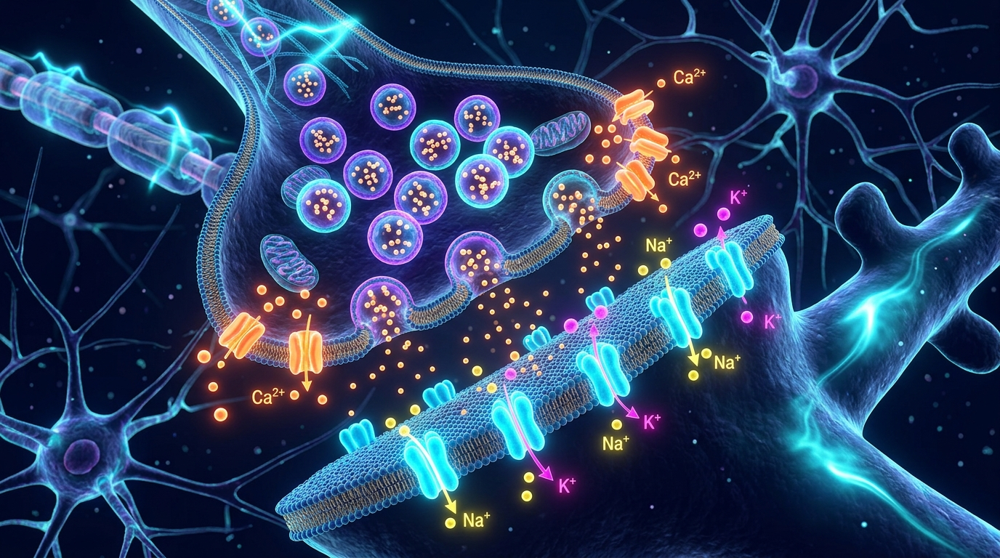

# MigraineRelief AI 🧠⚡
> **Precision Acute Rescue Optimization, Longitudinal Treatment-Response Intelligence & N-of-1 Neurological Decision Support**



---

## 📌 Project Overview
**MigraineRelief** is a precision digital health platform engineered to solve the most painful, high-uncertainty decision in headache medicine: **the acute attack rescue window**. 

Rather than relying on unvalidated trigger hunts, toy diagnostic classifiers, or passive symptom diaries, MigraineRelief models the temporal dynamics of acute attacks—matching patient phenotype, prodrome markers, gastric motility, and allodynia onset to the optimal abortive protocol (medication, formulation, delivery route, and adjuvant antiemetic) within the critical pre-sensitization window.

### Key Clinical Concepts & Terminology
* **Prodrome Markers**: Prodrome markers are early physical, behavioral, or biological signs that appear before a disease is fully diagnosed or reaches its severe phase (e.g., subtle neck stiffness, yawning, mood changes, sensory alterations hours before pain onset).  
  * Watch: [(The role of prodromal symptoms in predicting headache onset)](https://www.youtube.com/watch?v=9MIx21I1FRY&t=223s)
* **Contemporary Acute Pharmacotherapy**: For a comprehensive clinical reference on evidence-based abortive therapies across age groups, consult:  
  * Read: [Acute Migraine Treatment & Medications Guide](https://cps.ca/en/documents/position/acute-migraine)

By closing the loop between **Context → Intervention → Timing → Response → Outcome**, MigraineRelief builds a defensible, proprietary **Intervention-Response Graph** that systematically reduces acute rescue failure, prevents Medication Overuse Headache (MOH), and optimizes preventative transitions.

## 📖 Canonical Documentation & Engineering Specifications
* **[Engineering Implementation Guide (implementation.md)](implementation.md)**: Concrete file-by-file codebase specification, Pydantic schemas, deterministic safety gates, route switching, OpenViking integration, test suites, and 8-week execution roadmap.
* **[System Architecture & Technical Design (system_design.md)](system_design.md)**: Deep COGS analysis, Phase 0 fast-path monolith, scalable microservices topology, OpenViking (`viking://`), evaluation harness engineering, and multi-agent StateGraph flow.
* **[Product Requirements Document (PRD.md)](PRD.md)**: Exhaustive product specifications, clinical foundations, user personas, acute rescue architecture, and phased MVP rollout.
* **[Historical Brainstorm Archive (brainstorm.md)](brainstorm.md)**: Initial exploratory brainstorming, multi-agent concepts, and clinical literature catalog.
* **[Assets](assets/)**: Biomolecular visuals and architecture diagrams.

## 👥 Core Clinical Personas
1. **Alexa Rivera (Female, Age 15)** — High school sophomore with episodic probable migraine, navigating school-hours rescue decisions, pubertal hormonal shifts, sedation constraints, and high risk of rebound headache from OTC analgesics.
2. **Claire Sterling (Female, Age 45)** — Professional and mother with chronic refractory migraine and severe acute gastric stasis (nausea & emesis), repeatedly failing oral medications due to malabsorption and delayed timing.

## 🔬 Core Scientific & Clinical Anchors
* **The Race Against Central Sensitization**: Aborting attacks before the onset of cutaneous allodynia locks in central pain pathways (Burstein et al., *Ann Neurol* 2004).
* **Bypassing Gastric Stasis**: Utilizing non-oral delivery routes (intranasal POD DHE, subcutaneous auto-injectors, suppositories, nasal gepants) when acute gastroparesis shuts down GI absorption (Aurora et al., *Headache* 2022).
* **Reframing Triggers as "Threshold Modifiers"**: Abandoning simplistic trigger-blaming in favor of a cumulative allostatic load model (sleep debt + stress drop + hormonal shifts) that lowers the brain's resistance threshold.
* **Updated 2026 US Emergency Department (ED) Guidelines (AHS Consensus led by Dr. Jennifer Robblee)**:
  * In the updated 2025/2026 AHS Emergency Department guidelines, two parenteral therapies are elevated to **Level A ("Must Offer")** recommendations:
    1. **Intravenous (IV) Prochlorperazine (prochlorazine)**: Dopamine antagonist outperforming opioids with superior efficacy and zero dependency risk ([PubMed: 11335783](https://pubmed.ncbi.nlm.nih.gov/11335783/)).
    2. **Greater Occipital Nerve Blocks (GONB)** for migraine patients including teens: Fast-acting peripheral nerve block intercepting trigeminocervical transmission ([Nerve Blocks in Pediatric and Adolescent Headache Disorders, PubMed: 29124490](https://pubmed.ncbi.nlm.nih.gov/29124490/)).
  * Guidelines explicitly designate **IV opioids (hydromorphone)** as **Level A ("Must NOT Offer")**.
  * Clinical discussion & overview: [Dr. Jennifer Robblee Presentation & SGEM Guidelines Review](https://thesgem.com/2026/01/sgem-xtra-hit-me-with-your-best-block-2025-ahs-ed-migraine-guidelines/) | [YouTube Video Overview](https://www.youtube.com/watch?v=JmYj-90V63w)
* **Medication Overuse Headache (MOH) Guardrails**: Enforcing strict monthly limit envelopes (ICHD-3 Section 8.2) across triptans, ergots, gepants, and combination analgesics.
* **Zero-Friction Anonymous Self-Service Analyzer**: Allowing patients to anonymously upload Apple Health, Oura, or diary exports to receive instant personal diagnostic audits without creating an account or disclosing PHI.
* **Transparent Epistemic Tagging**: Clearly labeling all system insights by scientific certainty: Level 1 (Confirmed Protocol), Level 2 (Clinical Trial Prior), Level 3 (Exploratory Population Baseline), or Level 4 (Patient-Specific Posterior).


## 🚀 Quickstart & Local Execution

### 1. Backend Service & Automated Tests
```bash
# Setup Python 3.11+ virtual environment
python3 -m venv .venv
source .venv/bin/activate

# Install locked production dependencies
pip install -r requirements.txt

# Run full evaluation test harness (44 tests, 96% coverage)
pytest --cov=app tests/

# Start local FastAPI server on http://localhost:8000
uvicorn app.main:app --reload --port 8000
```

### 2. Client-Side PWA (Vite + React)
```bash
cd frontend
npm install
npm run dev
# Access UI at http://localhost:5173
```

### 3. Production Container Deployment
```bash
# Spin up via Docker Compose
docker-compose up --build
```

---
*Disclaimer: MigraineRelief is an educational decision-support and research platform designed to assist clinical shared decision-making. It does not issue unilateral prescribing directives.*
