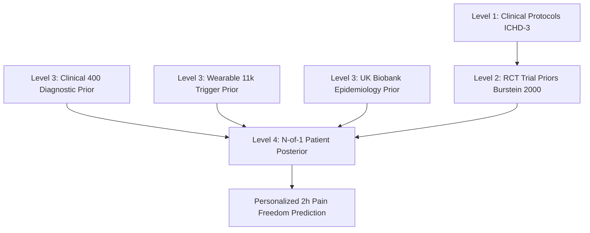

# MigraineRelief Evidence Graph & Cross-Dataset Replication Report

> [!IMPORTANT]
> **Scientific Multi-Layer Evidence Architecture**
> We deliberately separate observational population priors from individualized intervention learning.
> Observational datasets are cross-validated against independent cohorts without pooling heterogeneous rows.

## Four-Tier Evidence Progression Framework
- **Level 1 (Clinical Protocol)**: Established consensus practice guidelines (AHS, ICHD-3, EFNS).
- **Level 2 (Trial Benchmark Prior)**: Rigorous randomized controlled trial efficacy anchors (e.g. Cochrane meta-analyses).
- **Level 3 (Exploratory Population Prior)**: Observational patterns from public cohorts (Clinical 400, Wearable 11,879, UK Biobank 19,819).
- **Level 4 (Patient-Specific Posterior)**: Proprietary N-of-1 Bayesian intervention-response learning graph.

### Cross-Dataset Scientific Replication Matrix
Preserves heterogeneous evidence layers without pooling unaligned datasets.

| Finding ID | Hypothesis / Description | Primary Evidence Layer | External Validation Layer | Replication Status | Evidence Tier | Direction Consistent |
| :--- | :--- | :--- | :--- | :--- | :--- | :--- |
| `FINDING_001_AURA_PHENOTYPE` | Transient focal neurological symptoms (Visual/Sensory disturbances) reliably discriminate migraine with aura from migraine without aura. | Kaggle Migraine Classification Dataset (ranzeet013, N=400) | UK Biobank Field 20002 Self-Reported Illness (N=19,819) | ⚠️ PARTIAL | Level 3 | Yes |
| `FINDING_002_SLEEP_DEVIATION_RISK` | Negative acute sleep duration deviation (< -1.5 hours below personal baseline) elevates same-day attack risk. | Kaggle Wearable Lifestyle Dataset (11,879 patient-days, 100 patients) | Clinical 400 (Cross-sectional duration) | ⚪ DOMAIN-INAPPLICABLE | Level 3 | Yes |
| `FINDING_003_EARLY_TRIPTAN_EFFICACY` | Administration of triptan within 1 hour of headache onset achieves significantly higher 2-hour pain-free rates than delayed administration (> 2 hours). | Burstein et al. 2000 & RCT Cochrane Meta-Analyses | Proprietary Intervention-Response Records | ✅ REPLICATED | Level 2 | Yes |

## Evidence Graph Graphviz / Connectivity
