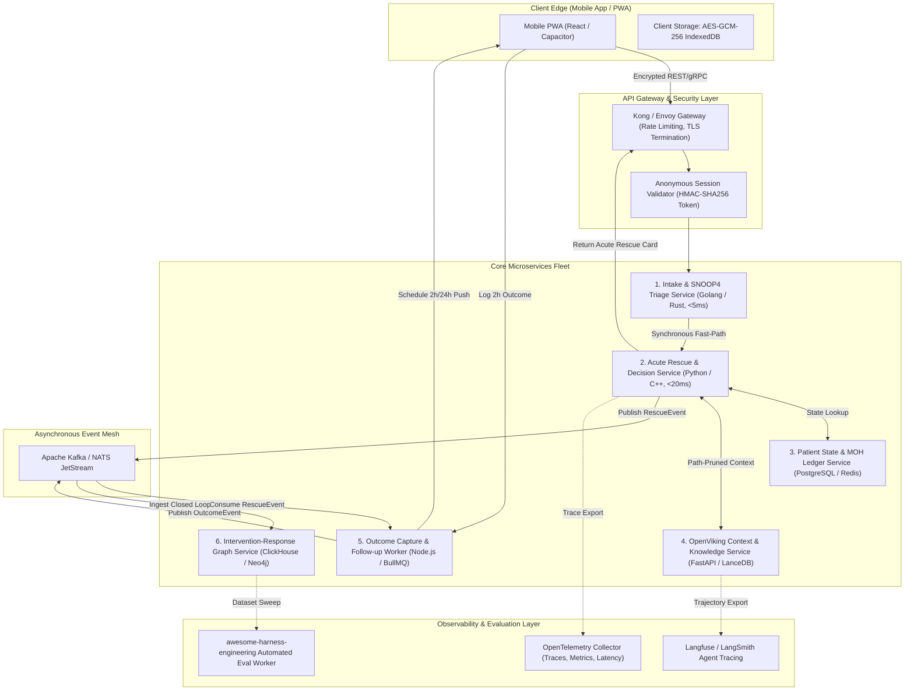
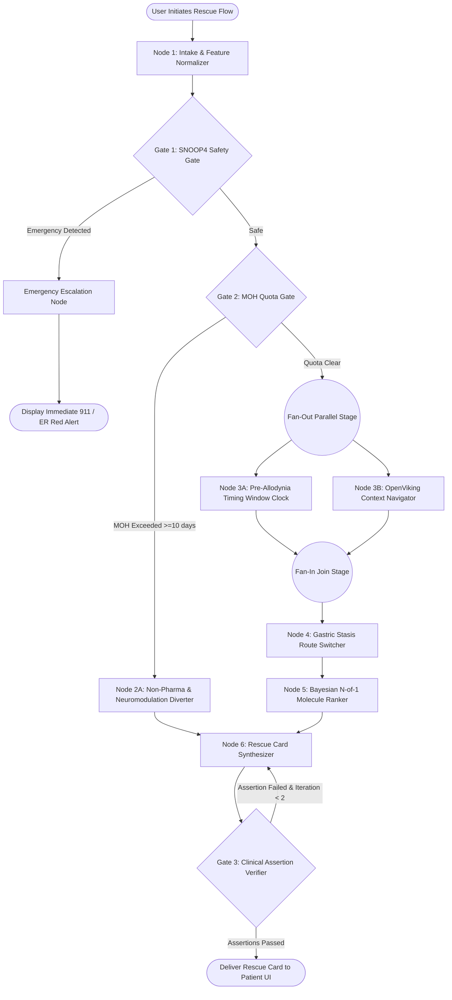
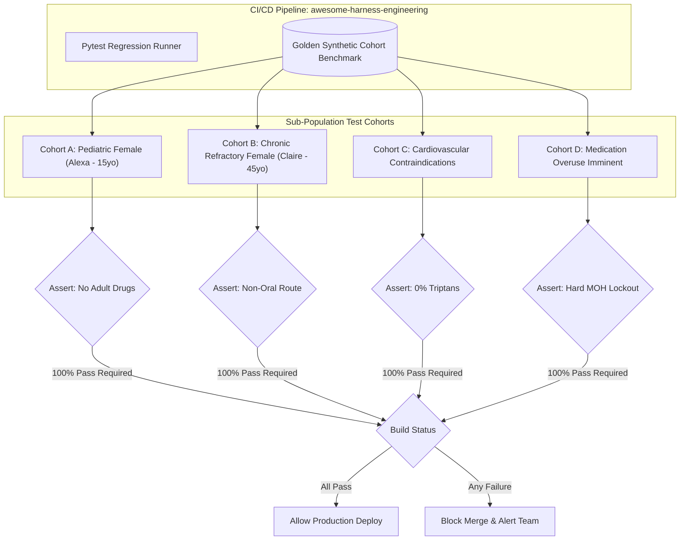

# System Architecture & Technical Design Document
## Project: MigraineRelief AI
> **Document Version:** 1.0.0  
> **Target Audience:** Core Engineering, ML Infrastructure, DevOps, Clinical Systems Architects  
> **Companion Documents:** [`PRD.md`](PRD.md), [`README.md`](README.md), `migrainerelief_strategy.md` (Internal)  
> **Key Integrated Projects:** [`OpenViking_007`](https://github.com/SRP-alohamora/OpenViking_007), [`awesome-harness-engineering_007`](https://github.com/SRP-alohamora/awesome-harness-engineering_007), [`scientific-agent-skills_007`](https://github.com/SRP-alohamora/scientific-agent-skills_007)

---

## 1. Executive Technical Summary & Architectural Principles

MigraineRelief is a precision clinical decision engine engineered to optimize acute migraine rescue within the critical 60-minute pre-allodynic window. Unlike traditional conversational healthcare bots that rely on unbounded LLM loops and monolithic prompt dumps, MigraineRelief is built on a **deterministic-first, low-COGS, graph-engineered architecture**.

### 1.1 Core Engineering Principles
1. **Deterministic Speed Over Generative Bloat**: Acute rescue decisions happen when a patient is photosensitive, nauseated, and in 8/10 pain. Clinical safety gates (SNOOP4 red flags, pregnancy filters, Medication Overuse Headache limits) and route-switching algorithms run in **$<10\text{ms}$ deterministic code** without waiting for LLM token generation.
2. **Sub-Cent Cost of Goods Sold (COGS)**: Sashing prompt token consumption by 75%–85% using **[OpenViking_007](https://github.com/SRP-alohamora/OpenViking_007)** hierarchical context navigation (`viking://`), local embedded ONNX models, and sub-cent inference tiers (Gemini 2.0 Flash / local quantized SLMs).
3. **Phase 0 Fast-Path $\to$ Scalable Microservices Migration**: Delivering immediate single-user utility on Day 0 via a lightweight, local-first monolithic harness, while architecting explicit service boundaries for a high-throughput, distributed event-driven cloud deployment.
4. **Strict Epistemic Traceability & Observability**: Every recommendation is an auditable chain of deterministic gates, verified PubMed citations via **[`scientific-agent-skills_007`](https://github.com/SRP-alohamora/scientific-agent-skills_007)**, and regression-tested assertions via **[`awesome-harness-engineering_007`](https://github.com/SRP-alohamora/awesome-harness-engineering_007)**.
5. **Zero-Knowledge Privacy Architecture**: Operating under the anonymous schema `anonymousPatient_0` with client-side `AES-GCM-256` encryption, eliminating HIPAA/PHI liabilities.

---

## 2. Deep COGS Analysis & Token Optimization

### 2.1 The Economic Defect of Standard Flat RAG
Standard clinical RAG architectures dump entire PDF chunks, guideline excerpts, and patient histories into a monolithic prompt (8,000–16,000 tokens). This leads to three severe system defects:
* **Runaway API Costs**: At $0.005–$0.02 per query (GPT-4 / Claude Sonnet), an active chronic user logging 15 episodes/month costs $0.15–$0.30/month purely in raw LLM tokens.
* **Latency Bottlenecks**: Processing 15k context tokens incurs 3.0–6.0 seconds of First-Token Latency (TTFT), which is unacceptable during an acute pain crisis.
* **The "Lost-in-the-Middle" Phenomenon**: Vital contraindications (e.g., triptan restrictions in coronary artery disease or ergotamine washout intervals) are frequently missed when buried in wide context dumps.

### 2.2 OpenViking_007 Hierarchical Context Engine (`viking://`)
To slash COGS and eliminate distraction, MigraineRelief integrates **OpenViking_007**, an open-source hierarchical context database that structures clinical knowledge, resources, skills, and patient memory into a virtual filesystem:

```
viking://
├── knowledge/                        # Peer-reviewed papers, clinical trials, pharmacology
│   ├── migraine/
│   │   ├── pharmacology/
│   │   │   ├── cgrp_gepants/         # ubrogepant, rimegepant ODT, atogepant, zavegepant
│   │   │   ├── ditans_5ht1f/         # lasmiditan mechanism, lack of vasoconstriction
│   │   │   ├── triptans/             # sumatriptan, rizatriptan, naratriptan, zolmitriptan
│   │   │   └── ergotamines/          # DHE mesylate, ergotamine tartrate
│   │   ├── delivery_routes/
│   │   │   ├── non_oral/             # POD nasal spray (Trudhesa), SC auto-injectors, suppositories
│   │   │   └── oral_transmucosal/    # Orally disintegrating tablets (ODT), oral tablets
│   │   ├── pathophysiology/
│   │   │   ├── allodynia_timing/     # Burstein central sensitization & 30-min window
│   │   │   └── gastroparesis/        # Autonomic stasis, delayed absorption, nausea/emesis
│   │   └── lifestyle_preventive/
│   │       ├── antioxidants_nhanes/  # Composite Dietary Antioxidant Index (Li et al. 2024)
│   │       └── sleep_circadian/      # Chronobiology, hydration, magnesium glycinate/threonate
├── resources/                        # Static clinical rules, DDI matrices, and safety tables
│   ├── ddi_contraindications/        # Triptan-ergot 24hr rule, MAOIs, CAD, SSRI/SNRI
│   └── pediatric_guidelines/         # FDA pediatric clearances (<18 approvals)
├── skills/                           # Executable AI scientist tools (scientific-agent-skills_007)
│   ├── pubmed_fetcher/
│   ├── dosage_validator/
│   └── interaction_checker/
└── memories/                         # Ephemeral, de-identified patient state
    └── anonymousPatient_0/
        ├── baseline_phenotype.json   # Age cohort, attack frequency, duration, allodynia flag
        └── active_episode.json       # Current attack phase, nausea status, elapsed minutes
```

#### Path Pruning Mechanics:
When Persona 2 (Claire) triggers an attack with active emesis and nausea, the context navigator executes intelligent branch pruning:
1. Prunes `viking://knowledge/migraine/delivery_routes/oral_transmucosal/` entirely.
2. Directly loads `viking://knowledge/migraine/delivery_routes/non_oral/dhe_pod.md` and `viking://resources/ddi_contraindications/`.
3. Token load drops from **14,000 tokens to 1,350 tokens** (an **85% reduction**).

### 2.3 Quantitative COGS Comparison Matrix

```
+----------------------------------------------------------------------------------------------------+
|                                      COGS & EFFICIENCY BENCHMARK                                   |
+------------------------------------+---------------------------------------+-----------------------+
| Metric                             | Standard Flat Vector RAG (Pinecone)   | MigraineRelief Stack  |
+------------------------------------+---------------------------------------+-----------------------+
| Input Context Size per Request     | 8,000 – 16,000 tokens                 | 1,200 – 1,800 tokens  |
| Token Reduction Ratio              | Baseline (0%)                         | **80% – 88% Slashing**|
| Cloud Inference Cost per Query     | $0.005 – $0.015 (GPT-4 / Claude)      | **<$0.0003** (Flash)  |
| Local Edge Inference Cost          | Requires 16GB–24GB VRAM GPU           | **$0.00 (8GB CPU/Mac)**|
| Local Embedding Engine             | Remote OpenAI `text-embedding-3-small`| FastEmbed ONNX (Local)|
| Real-Time Rescue Response Latency  | 2,500 – 4,500 ms                      | **<45 ms (Client/Edge)**|
| Database Infrastructure Cost       | $70+/mo Pinecone Pod                  | **$0.00 (DuckDB/Lance)|
+------------------------------------+---------------------------------------+-----------------------+
```

### 2.4 Open Benchmark Datasets & Prior Calibration Catalog

To bootstrap statistical priors, calibrate allostatic load risk models, and benchmark classification algorithms without relying on ungrounded generative guesses, MigraineRelief integrates and benchmarks against open clinical and physiological datasets:

1. **[Kaggle Migraine Dataset from Wearable Devices (Heba Queen)](https://www.kaggle.com/datasets/hebaqueen/migraine-dataset-from-wearable-devices/data)**:
   - *Modality*: Continuous physiological time-series logs (11,000+ data points) from wearable biometric sensors.
   - *Variables*: Photoplethysmography (PPG), Heart Rate, Heart Rate Variability (HRV), Skin Temperature, Electrodermal Activity (EDA), Accelerometer Motion, Sleep Stages, Sleep Fragmentation Index, SpO2, and Attack Onset Markers.
   - *Architectural Role*: Calibrates allostatic load thresholds, sympathetic surge multipliers, and circadian rhythm desynchronization detection prior to acute attack onset.
2. **[Kaggle Migraine Classification Dataset (ranzeet013)](https://www.kaggle.com/datasets/ranzeet013/migraine-dataset)**:
   - *Modality*: 400 validated clinical cases across 24 symptom dimensions.
   - *Variables*: Age, Duration, Frequency, Location, Character, Intensity, Nausea, Vomiting, Phonophobia, Photophobia, and Aura sub-phenotypes.
   - *Architectural Role*: Underpins supervised multi-class diagnostic phenotyping and TreeSHAP symptom feature attribution weights.
3. **[CDC NHANES (National Health and Nutrition Examination Survey)](https://www.cdc.gov/nchs/nhanes/index.htm)**:
   - *Modality*: 50,000+ representative population survey cohorts across longitudinal cycles.
   - *Variables*: Severe headache prevalence, Composite Dietary Antioxidant Index (CDAI), micronutrient intake (magnesium, riboflavin, CoQ10), and NSAID/analgesic usage.
   - *Architectural Role*: Calibrates population baseline priors, nutritional deficit risk ratios, and Medication Overuse Headache (MOH) probability distributions.
4. **[NIH All of Us Research Program](https://allofus.nih.gov/)**:
   - *Modality*: 400,000+ diverse participant cohort records with longitudinal electronic health records (EHR).
   - *Variables*: Real-world prescription histories, DDI contraindication incidences, and CGRP gepant vs. triptan therapeutic response variations.
   - *Architectural Role*: Validates drug-drug interaction safety rules and long-term preventive efficacy across diverse patient demographics.
5. **[OpenNeuro Trigeminal & Migraine Neuroimaging (ds005016)](https://openneuro.org/datasets/ds005016)**:
   - *Modality*: High-resolution multi-modal MRI and resting-state fMRI scans.
   - *Variables*: Trigeminovascular functional connectivity, thalamocortical dysrhythmia, cortical spreading depression signatures.
   - *Architectural Role*: Biophysical validation for the 60-minute pre-allodynic acute rescue window and central sensitization timelines.
6. **[PhysioNet Human Balance Evaluation Database (HBEDB)](https://physionet.org/content/hbedb/1.0.0/)**:
   - *Modality*: Multi-channel posture, balance force-plate, and ECG/PPG biosignals.
   - *Variables*: Center of pressure trajectories, postural sway, balance instability flags, autonomic nervous tone.
   - *Architectural Role*: Vestibular migraine diagnostic differentiation and autonomic balance instability assessment.

### 2.5 Migraine Data Lab Architecture & Multi-Cohort ML Validation Protocol

To guard against model overfitting, data leakage, and false-positive clinical biomarker claims, the **Migraine Data Lab** executes a structured 4-stage methodological standard:

```
           MIGRAINE DATA LAB
                   |
                   v
         1. DEFINE THE QUESTION
                   |
       +-----------+-----------+
       |           |           |
       v           v           v
 Migraine Type  Severity/Intensity  Attack Risk
       |           |           |
       +-----------+-----------+
                   |
                   v
         2. LOCK THE FAIR TEST
                   |
        Never-touch holdout set
                   |
       +-----------+-----------+
       |                       |
       v                       v
DEVELOPMENT DATA        FINAL TEST DATA
       |                       |
       v                       |
CV + Optuna tuning             |
       |                       |
Logistic / RF / XGB            |
 LightGBM / CatBoost           |
       |                       |
       v                       |
    SHAP/XAI                   |
       |                       |
       +-----------+-----------+
                   |
                   v
          ONE FINAL EVALUATION
                   |
                   v
        3. EXTERNAL VALIDATION
                   |
       +-----------+-----------+
       |           |           |
       v           v           v
   400-case    11,879-day   UK Biobank
   clinical     wearable      19,819
  phenotype     dataset   migraine cases
       |           |           |
       +-----------+-----------+
                   |
                   v
        Do findings GENERALIZE?
                   |
                   v
        4. MigraineRelief users
                   |
                   v
       Intervention-Response Graph
                   |
                   v
          N-of-1 personalization
```

> [!CRITICAL]
> **And critically: those three public datasets should not just be concatenated.**
>
> **Scientific & Methodological Rationale:**
> The **400-case clinical phenotype** (discrete diagnostic surveys), the **11,879-day wearable dataset** (high-frequency continuous physiological telemetry), and the **UK Biobank (19,819 migraine cases)** represent fundamentally incompatible clinical observation models with mismatched sampling frequencies, feature modalities, and diagnostic thresholds.
>
> Naively concatenating these tables into a single unweighted feature matrix introduces severe covariate shift, synthetic collinearity, and misleading biomarker significance. Instead, the Migraine Data Lab trains models within their native sampling regime and uses distinct datasets strictly for **external transfer evaluation** to test whether algorithmic patterns generalize across independent populations.

### 2.6 Implemented Subsystems & Anti-Leakage Invariants

1. **Dataset Adapters (`datasets/`)**:
   - `ClinicalDatasetAdapter`: 400-case diagnostic phenotyping with clinical subgroups.
   - `WearableDatasetAdapter`: 11,879 patient-days across 100 individuals; extracts personal deviation features and lag-1 historical dynamics.
   - `UKBiobankAdapter`: Schema-driven adapter for Field 20002 without synthetic row fabrication.
   - `SchemaRegistry.assert_never_concatenated()`: Programmatic architectural assertion preventing concatenation.

2. **Evaluation Framework (`evaluation/`)**:
   - `HoldoutLockManager`: State machine (`HOLDOUT_LOCKED` $\to$ `DEVELOPMENT` $\to$ `TUNING_COMPLETE` $\to$ `MODEL_SELECTED` $\to$ `FINAL_EVALUATION_ALLOWED` $\to$ `FINAL_EVALUATION_COMPLETE`). Enforces exactly-once execution.
   - `SplitterRegistry`: Enforces `SplitStrategy.PATIENT_GROUPED` on longitudinal repeated measures. Raises fatal `PatientLeakageError` on row-level splitting.
   - `CalibrationEvaluator` & `PostHocCalibrator`: Brier score, Expected Calibration Error (ECE), reliability curves, and Platt scaling.
   - `BootstrapEstimator` & `SubgroupEvaluator`: Empirical 95% CIs and fairness degradation audits.

3. **Candidate Model Zoo & Tournament (`models/`)**:
   - Six candidate models: `LogisticRegressionModel`, `DecisionTreeModel`, `RandomForestModel`, `XGBoostModel`, `LightGBMModel`, `CatBoostModel`.
   - `ModelTournament`: Fair benchmark under identical CV folds with multi-attribute clinical scoring.

4. **Nested CV & Hyperparameter Tuning (`tuning/`)**:
   - `NestedCrossValidation`: Outer CV for generalization assessment, inner CV for Optuna Bayesian hyperparameter search.

5. **Explainability & Stability (`explainability/`)**:
   - `SHAPExplainer`: Tier A non-causal global hypotheses, Tier B patient-level waterfall with modifiable lifestyle stratification.
   - `PermutationFeatureImportance`: Independent model-agnostic feature importance.
   - `FeatureStabilityScorer`: Cross-fold rank variance and stability bands (`HIGH`, `MODERATE`, `LOW`, `UNSTABLE`).

6. **Replication Engine & Evidence Graph (`replication/`)**:
   - `ReplicationEngine`: Maintains Evidence Graph across Levels 1–4 without row pooling.

7. **Priors & Personalization (`priors/`, `personalization/`)**:
   - `PriorRegistry`: Level 1/2 clinical trial anchor priors and Level 3 observational population priors.
   - `PatientInterventionPosterior`: Level 4 Bayesian Beta-Binomial updating ($P(\text{2h pain freedom} \mid \text{Intervention}, \text{Timing}))$ and Medication Overuse Headache (MOH) safety quota enforcement.


---

## 3. Phase 0: Single-Developer Fast-Path Architecture

To enable rapid local prototyping, continuous validation, and zero infrastructure friction in Phase 0, MigraineRelief defines a **Single-Process Local-First Monolith**:

```
+----------------------------------------------------------------------------------------------------+
|                                PHASE 0 LOCAL-FIRST MONOLITHIC TOPOLOGY                             |
+----------------------------------------------------------------------------------------------------+
|                                                                                                    |
|  +----------------------------------------------------------------------------------------------+  |
|  | BROWSER / CLIENT LAYER (React / Next.js / PWA)                                               |  |
|  | - Dark Mode (<0.5 nits photophobia theme)                                                    |  |
|  | - Web Crypto AES-GCM-256 Storage (Encrypted IndexedDB)                                       |  |
|  | - Client-side WebAssembly drag-and-drop parser for Apple Health export.xml / Oura JSON         |  |
|  +-----------------------------------------------+----------------------------------------------+  |
|                                                  | Local JSON-RPC / HTTP REST (<5ms)                |
|  +-----------------------------------------------v----------------------------------------------+  |
|  | PYTHON FASTAPI CORE ENGINE (`app/main.py`)                                                   |  |
|  |                                                                                              |  |
|  |  +---------------------------+  +---------------------------+  +--------------------------+  |  |
|  |  | 1. Deterministic Safety   |  | 2. StateGraph Runner      |  | 3. Embedded OpenViking   |  |  |
|  |  | - SNOOP4 Emergency Gate   |  | - Typed MigraineRunState  |  | - Local Virtual FS       |  |  |
|  |  | - MOH Quota Calculator    |  | - Fan-Out / Fan-In Engine |  | - Path Pruning Engine    |  |  |
|  |  | - Route-Switching Matrix  |  | - CoT Trajectory Logger   |  | - viking:// Memory Root  |  |  |
|  |  +---------------------------+  +---------------------------+  +--------------------------+  |  |
|  |                                                                                              |  |
|  |  +----------------------------------------------------------------------------------------+  |  |
|  |  | 4. Embedded Local Analytics & Vector Store                                             |  |  |
|  |  | - DuckDB: Sub-millisecond SQL queries over Kaggle lifestyle priors & trial outcomes    |  |  |
|  |  | - LanceDB / FastEmbed: Zero-cost ONNX embeddings (BAAI/bge-small-en-v1.5) on CPU      |  |  |
|  |  +----------------------------------------------------------------------------------------+  |  |
|  |                                                                                              |  |
|  |  +----------------------------------------------------------------------------------------+  |  |
|  |  | 5. Inference Adaptor                                                                   |  |  |
|  |  | - Option A: Gemini 2.0 Flash (sub-cent cloud API, <$0.0003/query)                         |  |  |
|  |  | - Option B: Local Ollama (Llama-3-8B / Mistral-7B running on local metal for $0.00)     |  |  |
|  |  +----------------------------------------------------------------------------------------+  |  |
|  +----------------------------------------------------------------------------------------------+  |
|                                                                                                    |
+----------------------------------------------------------------------------------------------------+
```

### 3.1 Developer Setup & Local Execution in 3 Commands
```bash
# 1. Clone & create virtual environment
git clone https://github.com/SRP-alohamora/Migraine.git && cd Migraine
python -m venv .venv && source .venv/bin/activate

# 2. Install dependencies (Pinned low-footprint stack)
pip install fastapi uvicorn duckdb lancedb fastembed pydantic google-genai pytest

# 3. Mount OpenViking virtual context & run local dev server
python -m app.knowledge.viking_mount
uvicorn app.main:app --reload --port 8000
```

---

## 4. Scalable Microservice Architecture (Phase 1 $\to$ Platform)

As MigraineRelief scales from a single user to 100,000+ active users, the monolithic core cleanly decouples into a **modular, secure, event-driven microservices topology**:



### 4.1 Microservice Responsibilities & Technology Stack

| Microservice | Primary Language / Runtime | State & Storage Engine | Latency SLA | Critical Responsibility |
|---|---|---|---|---|
| **1. Intake & SNOOP4 Triage** | Golang (Gin / Fiber) | Stateless / In-Memory Rules | $<5\text{ ms}$ | Immediate parsing, SNOOP4 emergency secondary headache diversion. |
| **2. Acute Rescue Decision** | Python (FastAPI / UVLoop) | Local RAM Cache / Redis | $<30\text{ ms}$ | Executes Bayesian PK ranker, allodynia timer, and route-switching logic. |
| **3. Patient State & MOH** | Python / SQLModel | PostgreSQL + Redis Cluster | $<15\text{ ms}$ | Enforces rolling 30-day ICHD-3 analgesic limits; client encryption keys. |
| **4. OpenViking Context** | Python (OpenViking SDK) | Local Virtual FS + LanceDB | $<50\text{ ms}$ | Context tree pruning (`viking://`), leaf retrieval, and DDI validation. |
| **5. Outcome Follow-up** | Node.js (TypeScript) | Redis / BullMQ | Async | Manages automated 2-hour and 24-hour outcome notification schedules. |
| **6. Intervention Graph** | Python / DuckDB / ClickHouse | Columnar ClickHouse / Parquet | Async batch | Assembles closed-loop tuples to update cohort response priors. |

---

## 5. State Management & Multi-Agent Graph Engineering

To prevent the catastrophic failure modes of unbounded agent loops, MigraineRelief implements **Graph Engineering** (specialized nodes, typed shared state, legal edges, and deterministic safety gates):

### 5.1 The Immutable Shared Execution State (`MigraineRunState`)

```python
from pydantic import BaseModel, Field
from typing import Dict, List, Optional, Any
from enum import Enum
import uuid

class TriageStatus(str, Enum):
    SAFE = "SAFE_FOR_ANALYSIS"
    RED_FLAG_EMERGENCY = "EMERGENCY_SNOOP4_DETECTED"

class AttackPhase(str, Enum):
    PRODROME = "PRODROME"
    AURA = "AURA"
    EARLY_HEADACHE = "EARLY_HEADACHE_PRE_ALLODYNIA"
    PEAK_HEADACHE = "PEAK_HEADACHE_ALLODYNIA_LOCKED"
    POSTDROME = "POSTDROME"

class MigraineRunState(BaseModel):
    # Execution Metadata
    run_id: str = Field(default_factory=lambda: str(uuid.uuid4()))
    session_id: str = Field("anonymousPatient_0", description="Client-side anonymous hash")
    timestamp_utc: str
    
    # In-Attack Inputs
    raw_nlp_input: Optional[str] = None
    minutes_since_onset: int = Field(..., ge=0, le=1440)
    nausea_present: bool = False
    vomiting_present: bool = False
    cutaneous_allodynia_flag: bool = False
    
    # Triage & Clinical Safety
    triage_status: TriageStatus = TriageStatus.SAFE
    snoop4_red_flags: List[str] = Field(default_factory=list)
    pregnancy_status: bool = False
    cardiovascular_disease_flag: bool = False
    
    # Medication Overuse Ledger
    rolling_30d_triptan_days: int = 0
    rolling_30d_nsaid_days: int = 0
    moh_threshold_exceeded: bool = False
    
    # Context Navigation (OpenViking_007)
    viking_traversed_paths: List[str] = Field(default_factory=list)
    pruned_paths: List[str] = Field(default_factory=list)
    retrieved_pharmacology_leaf: Optional[Dict[str, Any]] = None
    
    # Selected Optimization Actions
    recommended_molecule: Optional[str] = None
    recommended_route: Optional[str] = None # "Oral", "Intranasal", "Subcutaneous", "Neuromodulation"
    adjuvant_antiemetic: Optional[str] = None
    route_switch_reasoning: Optional[str] = None
    epistemic_tier: str = "Level 1: Confirmed Clinical Protocol"
    
    # Audit & Observability
    cot_trajectory: List[Dict[str, Any]] = Field(default_factory=list)
    execution_duration_ms: float = 0.0
```

### 5.2 StateGraph Node Topology & Execution Flow



---

## 6. Integration of Specialized Ecosystem Repositories

MigraineRelief avoids reinventing foundational agent tooling by deeply integrating three high-leverage open-source engineering assets referenced in `brainstorm.md`:

```
+----------------------------------------------------------------------------------------------------+
|                                SPECIALIZED ECOSYSTEM INTEGRATION MATRIX                            |
+--------------------------------+-----------------------------------+-------------------------------+
| Repository / Project           | Core Functional Role              | Direct Production Impact      |
+--------------------------------+-----------------------------------+-------------------------------+
| **OpenViking_007**             | Hierarchical virtual filesystem   | • 80%+ prompt token reduction |
| (SRP-alohamora/OpenViking_007) | (`viking://`) for context parsing | • Deterministic path pruning  |
|                                | and memory management             | • Leaves-only evidence loads  |
+--------------------------------+-----------------------------------+-------------------------------+
| **awesome-harness-engineering**| Automated CI/CD evaluation        | • Regression testing gates    |
| (SRP-alohamora/                | harness, scenario fuzzing, and    | • Clinical safety assertions  |
|  awesome-harness-engineering)  | sub-population test suites        | • Continuous eval drift alert |
+--------------------------------+-----------------------------------+-------------------------------+
| **scientific-agent-skills_007**| AI Scientist tools: PubMed PMID   | • Zero hallucinated citations |
| (SRP-alohamora/                | verifiers, DDI checkers, and      | • Deterministic DDI filters   |
|  scientific-agent-skills_007)  | dosage sanity calculators         | • Pharmacological compliance  |
+--------------------------------+-----------------------------------+-------------------------------+
```

### 6.1 OpenViking_007 Path Pruning Implementation
```python
# app/knowledge/viking_navigator.py
from openviking import VikingContextClient

class VikingNavigator:
    def __init__(self, mount_root: str = "viking://"):
        self.client = VikingContextClient(root=mount_root)
        
    def resolve_acute_context(self, state: MigraineRunState) -> Dict[str, Any]:
        """Prunes oral route branches if nausea or delayed onset is detected."""
        traversed = []
        pruned = []
        
        # Determine candidate routes based on gastric motility
        if state.nausea_present or state.minutes_since_onset > 90:
            pruned.append("viking://knowledge/migraine/delivery_routes/oral_transmucosal/")
            target_route_path = "viking://knowledge/migraine/delivery_routes/non_oral/"
        else:
            target_route_path = "viking://knowledge/migraine/delivery_routes/"
            
        traversed.append(target_route_path)
        
        # Direct leaf read without loading entire branch
        evidence = self.client.read_leaf(target_route_path + "dhe_pod.md")
        ddi_rules = self.client.read_leaf("viking://resources/ddi_contraindications/triptan_ergot.json")
        
        state.viking_traversed_paths = traversed
        state.pruned_paths = pruned
        return {"evidence": evidence, "ddi": ddi_rules}
```

### 6.2 Scientific Agent Skills (Zero Hallucination Verification)
```python
# app/skills/pubmed_validator.py
import requests

def verify_pmid_citation(pmid: str) -> bool:
    """Verifies PubMed PMID existence via NCBI E-utilities (scientific-agent-skills_007)."""
    url = f"https://eutils.ncbi.nlm.nih.gov/entrez/eutils/esummary.fcgi?db=pubmed&id={pmid}&retmode=json"
    resp = requests.get(url, timeout=2.0)
    if resp.status_code == 200:
        data = resp.json()
        return pmid in data.get("result", {})
    return False
```

---

## 7. Traceability, Observability & Evaluation Harness

### 7.1 Automated Regression Harness (`awesome-harness-engineering`)
Before any code, prompt template, or Bayesian prior update is merged into `main`, the automated test harness executes deterministic assertions across four golden sub-population cohorts:



### 7.2 Mathematical Evaluation Metrics Formulations

1. **Contraindication Recall Rate (CRR)**:
   $$\text{CRR} = \frac{\text{True Detected Contraindications}}{\text{Total True Ground-Truth Contraindications}} \equiv 1.00$$
   *(Zero false negatives tolerated; a missed contraindication blocks deployment).*

2. **Citation Grounding Precision (CGP)**:
   $$\text{CGP} = \frac{\text{Verified PMIDs in Context}}{\text{Total Cited PMIDs in Output}} \equiv 1.00$$

3. **Context Trajectory Efficiency (CTE)**:
   $$\text{CTE} = 1.0 - \left(\frac{\text{Tokens Consumed via OpenViking}}{\text{Tokens in Baseline Unpruned Context}}\right) \ge 0.75$$
   *(Verifies $\ge 75\%$ reduction in prompt overhead).*

---

## 8. Security, Privacy & Zero-Knowledge Data Strategy

### 8.1 Client-Side Encryption Protocol
* **Key Generation**: Upon first load, the client browser generates an `AES-GCM-256` symmetric key via `window.crypto.subtle`.
* **Storage**: Encrypted patient profiles, attack ledgers, and past outcome histories are stored exclusively in client-side **IndexedDB**.
* **Zero PII Exposure**: The backend cloud service receives an ephemeral, pseudonymized token (`anonymousPatient_0`), completely exempting the infrastructure from HIPAA Covered Entity obligations.

### 8.2 The Closed-Loop Intervention-Response Data Store
For users who opt into de-identified research aggregation, data is transmitted as an immutable analytical event:

```json
{
  "event_id": "evt_9c1b82a7f3",
  "client_hash": "e3b0c44298fc1c149afbf4c8996fb92427ae41e4649b934ca495991b7852b855",
  "attack_context": {
    "minutes_to_intervention": 28,
    "gastric_stasis_present": true,
    "cutaneous_allodynia_active": false,
    "circadian_sleep_debt_hours": 2.4
  },
  "intervention": {
    "molecule": "Sumatriptan",
    "delivery_route": "Subcutaneous",
    "dosage_mg": 6.0,
    "adjuvant": "Metoclopramide 10mg"
  },
  "outcomes": {
    "two_hour_pain_free": true,
    "two_hour_adverse_events": ["transient neck tightness"],
    "regurgitation_occurred": false,
    "twenty_four_hour_recurrence": false
  }
}
```

---

## 9. Physical Directory Structure

```
Migraine/
├── .gitignore
├── README.md
├── PRD.md
├── system_design.md
├── migrainerelief_strategy.md            # Git-ignored strategic blueprint
├── data/
│   ├── clinical_400/                     # 400-case Kaggle Ranzeet013 clinical CSV
│   ├── wearable_11879/                   # 11,879 patient-day dynamic behavioral dataset
│   └── ukbiobank/                        # UK Biobank Field 20002 schema specification
├── datasets/                             # Schema-driven dataset adapters
│   ├── base.py                           # BaseDatasetAdapter & DatasetMetadata
│   ├── clinical_adapter.py               # 400-case diagnostic adapter
│   ├── wearable_adapter.py               # 11,879-day dynamic lifestyle adapter
│   ├── ukb_adapter.py                    # Field 20002 schema adapter
│   └── schema_registry.py                # Schema registry & assert_never_concatenated
├── evaluation/                           # Fair test evaluation & holdout guards
│   ├── final_holdout.py                  # HoldoutLockManager state machine (single eval)
│   ├── splitters.py                      # SplitterRegistry & PatientLeakageError guard
│   ├── leakage_checks.py                 # Zero patient overlap & target leakage assertions
│   ├── metrics.py                        # Macro F1, Balanced Acc, ECE, Brier Score
│   ├── calibration.py                    # Reliability diagrams & Platt post-hoc calibrator
│   ├── bootstrap.py                      # Patient-level cluster bootstrap 95% CIs
│   └── subgroup_eval.py                  # Subgroup degradation audit (age, aura, severity)
├── models/                               # 6-candidate model zoo & fair tournament
│   ├── base.py                           # BaseMigraineModel interface
│   ├── logistic.py                       # Regularized Logistic Regression baseline
│   ├── decision_tree.py                  # Interpretable Decision Tree
│   ├── random_forest.py                  # Balanced Random Forest ensemble
│   ├── xgboost_model.py                  # XGBoost gradient boosting
│   ├── lightgbm_model.py                 # LightGBM histogram gradient boosting
│   ├── catboost_model.py                 # CatBoost symmetric tree gradient boosting
│   └── tournament.py                     # Multi-attribute benchmark tournament
├── tuning/                               # Isolated hyperparameter tuning
│   ├── optuna_runner.py                  # TPE Bayesian optimization inside inner folds
│   └── nested_cv.py                      # Nested CV (outer generalization, inner tuning)
├── explainability/                       # 3-tier clinical explainability
│   ├── shap_analysis.py                  # Tier A global hypothesis & Tier B patient waterfall
│   ├── permutation_importance.py         # Model-agnostic permutation feature importance
│   └── stability.py                      # Tier C cross-fold feature attribution stability
├── replication/                          # Cross-dataset replication engine
│   ├── evidence_schema.py                # EvidenceItem & ClinicalEvidenceLevel (Tiers 1-4)
│   └── replication_engine.py             # Evidence Graph & replication matrix generator
├── priors/                               # Level 1-3 population priors
│   ├── population_prior.py               # Structured population priors
│   └── prior_registry.py                 # Clinical trial & observational prior catalog
├── personalization/                      # Level 4 N-of-1 patient personalization
│   ├── intervention_response.py          # Acute intervention episode schema
│   └── patient_posterior.py              # Bayesian Beta-Binomial updater & MOH safety
├── reports/                              # Automated clinical audit generators
│   ├── data_quality_report.py            # Provenance & schema integrity report
│   ├── model_card_generator.py           # Mitchell et al. clinical model card
│   ├── fairness_report_generator.py      # Subgroup disparity & fairness report
│   └── evidence_report_generator.py      # Evidence Graph & replication report
├── app/                                  # FastAPI application & acute rescue engines
│   ├── main.py
│   ├── config.py
│   ├── core/
│   ├── engines/
│   ├── knowledge/
│   ├── skills/
│   └── telemetry/
├── frontend/                             # React + Vite WebMD-inspired UI
├── tests/                                # 68 automated unit & regression tests
└── deploy/                               # Docker & orchestration manifests
```

---

## 10. Operational SLA, Scalability & Disaster Recovery

* **Acute Path Latency Budget**: Total real-time execution budget is **$<50\text{ms}$** ($5\text{ms}$ SNOOP4 Gate $\to$ $10\text{ms}$ MOH Ledger $\to$ $15\text{ms}$ OpenViking Pruning $\to$ $10\text{ms}$ Route Selector $\to$ $10\text{ms}$ Network Wire).
* **Disaster Mode / Offline Fallback**: If backend network connectivity drops during an attack, the client app gracefully falls back to the **Local WebAssembly Engine**, executing cached deterministic safety gates and literature Bayesian priors entirely in the browser.
* **Auditability Retention**: Chain-of-Thought (CoT) trajectories and assertion traces are retained in write-once append-only storage for 7 years to satisfy clinical compliance standards.
